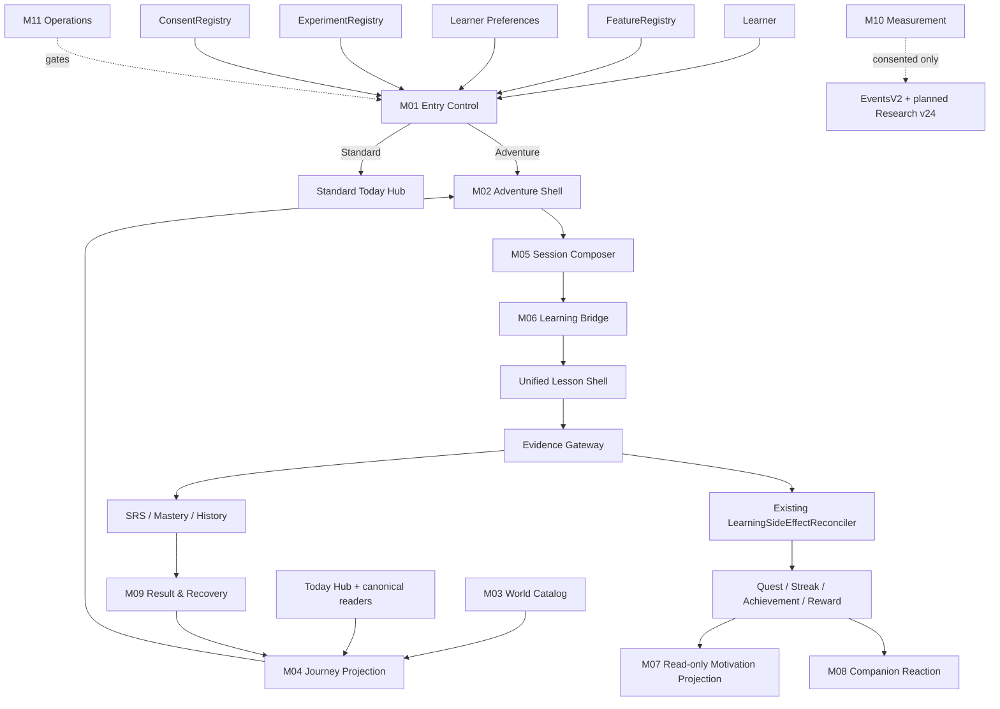
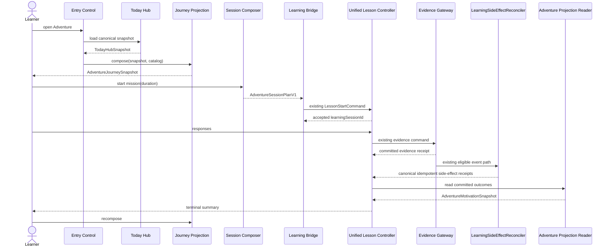
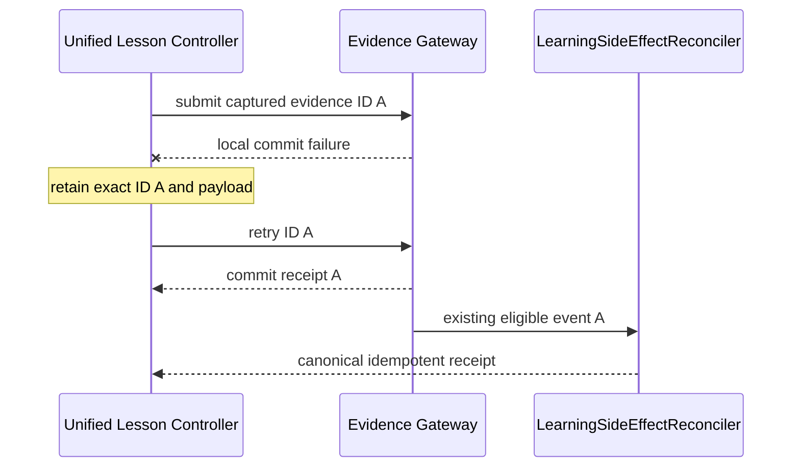

# Software Design Specification (SDS) — Adventure Motivation Mode

**Document ID:** LQ-AMM-SDS-001
**Version:** 1.0
**Status:** Draft for Owner Review
**Date:** 2026-09-01
**SRS reference:** `LQ-AMM-SRS-001 v1.0`
**Baseline:** commit `99f7fb21`, schema v22
**Audit reference:** `AMM-AUDIT-001 v1.0`; 15 baseline failures remain explicit gates

## 1. Design Decision Summary

Adventure เป็น bounded context ใหม่ที่ไม่มี write authority ต่อ learning/progress เดิม ประกอบด้วย 11 logical modules แต่จัดอยู่ใน package `lib/features/adventure/` เดียว การเชื่อมระบบเดิมทำผ่าน application ports และ canonical use cases เท่านั้น

การตัดสินใจที่ลดผลกระทบต่อ 8/44:

1. Standard Today Hub compose ตามปกติก่อน Adventure เสมอ
2. Journey เป็น pure/rebuildable projection; ไม่มี Adventure progress table
3. Phase 1 ไม่มี schema migration
4. Preference v2 วางแผนเพิ่มใน schema v23 หลัง shell/learning bridge ผ่าน gate แต่ implementation ต้อง reserve/rebase จาก ledger จริง
5. Research tables วางแผนเพิ่มใน schema v24 หลัง feature core ผ่าน gate แต่ implementation ต้อง reserve/rebase จาก ledger จริง
6. `EvidenceContext` และ learning-answer event ไม่เพิ่ม Adventure field
7. `AdventureOriginContextV1` เป็น transient launch context
8. เฉพาะ consented research exposure event เชื่อม presentation กับ session ID
9. Runtime flag, preference, assignment และ consent แยก repositories/ports
10. Existing static `LearningWorldMapScreen` ไม่ถูก reuse เป็น implementation

## 2. Architecture Views

### 2.1 Context view



### 2.2 Layer rule

```text
presentation  → application interfaces/use cases → domain models
                              ↓
                       data adapters
                              ↓
        existing authorities / Drift / outbox / assets
```

Forbidden dependencies:

- `lib/features/adventure/presentation/**` → `lib/data/local/**`
- Adventure → generated Drift row/data classes
- World catalog → Quest/Reward repository
- FeatureRegistry → Experiment assignment mutation
- Research measurement → learning correctness/mastery mutation

### 2.3 Authority matrix

| Fact | Authority | Adventure access |
|---|---|---|
| Content identity/revision | Vocabulary/Learning Pack | Read IDs/revisions |
| Answer correctness | Learning/Evidence | Submit through existing controller |
| Review due | SRS/Review | Read/launch |
| Mastery/weakness | Progress projection | Read-only |
| Quest | Quest | Process eligible event through use case |
| Streak | Gentle Streak | Process eligible event/read reaction |
| Achievement | Progress/Achievement | Read unlock result |
| XP/Coins/items | Reward | Typed idempotent command/read |
| Today work | Today Hub | Read and represent |
| Home presentation | LearnerPreferences v2 | Typed read/mutation |
| Experiment cohort | Experiment Registry | Read exact assignment |
| Consent | Consent Registry | Read processing eligibility |
| Journey position | Adventure Projection | Derived, never directly written |
| Motivation responses | Planned research v24 or reserved successor | Consent-aware use case |

## 3. Module Design

### 3.1 M01 — Delivery and Entry Control

**Files**

- `lib/features/adventure/domain/adventure_entry.dart`
- `lib/features/adventure/application/adventure_entry_use_cases.dart`
- modifications to `lib/runtime/registries/feature.dart`
- modifications to `lib/runtime/registries/feature_registry.dart`
- modifications to `lib/runtime/production_feature_contract.dart`
- modifications to `lib/runtime/app_dependencies.dart`

**Public domain contract**

```dart
enum AdventurePresentation { standard, adventure }

enum AdventureAvailability {
  available,
  hidden,
  disabled,
  emergencyOff,
  missingDependency,
  invalidCatalog,
  contentUnavailable,
  assignmentConflict,
}

enum AdventureFallbackReason {
  none,
  learnerChoseStandard,
  featureUnavailable,
  dependencyUnavailable,
  catalogUnavailable,
  contentUnavailable,
  assignmentUnavailable,
  emergencyOff,
}

final class AdventureEntryRequest {
  const AdventureEntryRequest({
    required this.ownerId,
    required this.occurredAtUtc,
    this.sessionChoice,
  });
  final String ownerId;
  final DateTime occurredAtUtc;
  final AdventurePresentation? sessionChoice;
}

final class AdventureEntryDecision {
  const AdventureEntryDecision({
    required this.availability,
    required this.presentation,
    required this.fallbackReason,
    required this.catalogVersion,
    this.experimentId,
    this.experimentVersion,
    this.assignmentId,
    this.treatment,
  });
  final AdventureAvailability availability;
  final AdventurePresentation presentation;
  final AdventureFallbackReason fallbackReason;
  final String catalogVersion;
  final String? experimentId;
  final int? experimentVersion;
  final String? assignmentId;
  final String? treatment;
}

abstract interface class AdventureEntryResolver {
  Future<AdventureEntryDecision> resolve(AdventureEntryRequest request);
}
```

**Decision precedence**

1. Noncanonical owner/time → reject input
2. emergencyOff → Standard
3. hidden/disabled → Standard
4. required dependency unavailable → Standard
5. catalog/content unavailable → Standard
6. active protocol assignment conflict → Standard with conflict reason
7. active protocol assignment → treatment presentation; Standard escape remains
8. explicit session choice → choice
9. persisted preference v2 → preference
10. no choice/preference → Standard

Entry resolver is read-only. It cannot create assignment, consent or preference.

### 3.2 M02 — Experience Shell

**Files**

- `lib/features/adventure/presentation/adventure_hub_screen.dart`
- `lib/features/adventure/presentation/adventure_mission_sheet.dart`
- `lib/features/adventure/presentation/widgets/adventure_map.dart`
- `lib/features/adventure/presentation/widgets/adventure_map_list.dart`
- `lib/features/adventure/presentation/widgets/adventure_status_panel.dart`
- `lib/features/adventure/presentation/widgets/adventure_standard_switch.dart`

`AdventureHubScreen` receives immutable snapshot, callbacks and `FeatureRegistry`. It owns only transient UI state: map/list selection, loading flags, focus target and visible sheet. It never receives a database object.

```dart
abstract interface class AdventureActionDelegate {
  Future<void> startMission(AdventureMissionRef mission);
  Future<void> resumeMission(String learningSessionId);
  Future<void> switchToStandard({required bool rememberChoice});
  Future<void> refresh();
  Future<void> repairAssets();
}
```

Each callback is guarded by a per-action in-flight set. Feature state is rechecked immediately before invocation to handle live emergency-off.

### 3.3 M03 — World, Story and Asset Catalog

**Files**

- `lib/features/adventure/domain/adventure_world_catalog.dart`
- `lib/features/adventure/data/packaged_adventure_world_catalog.dart`
- `lib/features/adventure/data/adventure_world_catalog_validator.dart`
- `assets/adventure/world_v1/catalog.th.json`
- `assets/adventure/world_v1/catalog.en.json`
- `assets/adventure/world_v1/manifest.json`

**Core types**

```dart
enum AdventureCatalogQaState { draft, internalApproved, pilotApproved }
enum AdventureNodeKind { resume, review, mission, rewardPreview }

final class AdventureWorldCatalog {
  const AdventureWorldCatalog({
    required this.schemaVersion,
    required this.catalogId,
    required this.catalogVersion,
    required this.locale,
    required this.qaState,
    required this.worlds,
    required this.reactions,
    required this.assetManifest,
  });
  static const int currentSchemaVersion = 1;
  final int schemaVersion;
  final String catalogId;
  final String catalogVersion;
  final String locale;
  final AdventureCatalogQaState qaState;
  final List<AdventureWorldDefinition> worlds;
  final List<CompanionScriptDefinition> reactions;
  final AdventureAssetManifest assetManifest;
}
```

Validator checks canonical IDs, exact allowed keys, version, QA state, duplicate IDs, prerequisite resolution, cycles, string/rune bounds, locale parity, asset path safety, SHA-256 and byte size. Invalid catalog is never partially accepted.

The initial graph is linear and contains exactly three learner-visible nodes: Resume/Review if applicable, Today Mission, Next Preview. The same definitions include list labels.

### 3.4 M04 — Journey Projection

**Files**

- `lib/features/adventure/domain/adventure_journey.dart`
- `lib/features/adventure/application/adventure_journey_reader.dart`

```dart
enum AdventureNodeState {
  hidden,
  locked,
  available,
  current,
  completed,
  unavailable,
}

final class AdventureJourneyRequest {
  const AdventureJourneyRequest({
    required this.ownerId,
    required this.evaluatedAtUtc,
    required this.catalog,
    required this.today,
  });
  final String ownerId;
  final DateTime evaluatedAtUtc;
  final AdventureWorldCatalog catalog;
  final TodayHubSnapshot today;
}

abstract interface class AdventureJourneyReader {
  Future<AdventureJourneySnapshot> compose(AdventureJourneyRequest request);
}
```

Projection algorithm v1:

1. Validate owner and version coherence
2. Resolve resumable session; if present, set resume node `current`
3. Resolve due Review items by canonical content identity
4. Resolve Today recommendation and reason
5. Read canonical Quest/Streak/Achievement/Reward/History summaries
6. Map facts to catalog presentation rules
7. Mark dependent nodes unavailable when one reader is unavailable/corrupt
8. Select exactly one primary mission: resume > assigned nonreward assessment in Standard only > due review > recommendation
9. Return immutable snapshot with input fingerprints

Assessment can appear as a neutral assigned-work card in Standard but is not converted to Adventure mission or reward node.

No cache is implemented in this scope.

### 3.5 M05 — Session Composer

**Files**

- `lib/features/adventure/domain/adventure_session_plan.dart`
- `lib/features/adventure/application/adventure_session_composer.dart`

```dart
final class AdventureOriginContextV1 {
  const AdventureOriginContextV1({
    required this.planId,
    required this.nodeId,
    required this.catalogId,
    required this.catalogVersion,
    required this.presentation,
  });
  static const int schemaVersion = 1;
  final String planId;
  final String nodeId;
  final String catalogId;
  final String catalogVersion;
  final AdventurePresentation presentation;
}

final class AdventureSessionPlanV1 {
  const AdventureSessionPlanV1({
    required this.planId,
    required this.ownerId,
    required this.createdAtUtc,
    required this.sourceEvaluatedAtUtc,
    required this.content,
    required this.mode,
    required this.configuration,
    required this.recommendationPolicyVersion,
    required this.origin,
    this.assignmentId,
    this.treatment,
  });
  final String planId;
  final String ownerId;
  final DateTime createdAtUtc;
  final DateTime sourceEvaluatedAtUtc;
  final List<ContentIdentity> content;
  final LessonMode mode;
  final SessionConfiguration configuration;
  final String recommendationPolicyVersion;
  final AdventureOriginContextV1 origin;
  final String? assignmentId;
  final String? treatment;
}

abstract interface class AdventureSessionComposer {
  Future<AdventureSessionPlanV1> compose({
    required AdventureMissionRef mission,
    required TodayHubSnapshot today,
    required SessionConfiguration requestedConfiguration,
    required AdventureEntryDecision entry,
  });
}
```

`planId` is a deterministic hash/ID derived from owner, source evaluation instant, mission/node, ordered content identities, mode/configuration and catalog/treatment versions. Repeated identical input cannot create a logically different plan.

### 3.6 M06 — Learning Bridge

**Files**

- `lib/features/adventure/application/adventure_learning_bridge.dart`

```dart
final class AdventureLessonLaunch {
  const AdventureLessonLaunch({
    required this.plan,
    required this.controller,
    required this.startCommand,
  });
  final AdventureSessionPlanV1 plan;
  final UnifiedLessonController controller;
  final LessonStartCommand startCommand;
}

abstract interface class AdventureLearningBridge {
  Future<AdventureLessonLaunch> prepare(AdventureSessionPlanV1 plan);
}
```

The bridge:

1. Revalidates feature and owner
2. Revalidates content/configuration versions
3. Creates existing controller through `UnifiedLessonControllerFactory`
4. Builds the same `LessonStartCommand` that Standard mode uses
5. Keeps `AdventureOriginContextV1` beside the launch only
6. Never adds Adventure fields to `EvidenceContext`, `LearningEventContext`, `AnswerAttempts` or learning event payload
7. Hands session ID to consent-aware behavior recorder after start acceptance

This yields a strong equivalence test: for the same canonical work/configuration, Standard and Adventure start commands and subsequent answer evidence are equal except for transient UI wrapper objects.

### 3.7 M07 — Motivation and Unlock Projection Reader

**Files**

- `lib/features/adventure/application/adventure_motivation_projection_reader.dart`

```dart
enum AdventureProjectionReceiptState { pending, committed, notEligible }

final class AdventureProjectionOutcome {
  const AdventureProjectionOutcome({
    required this.state,
    this.receiptId,
    this.displayCode,
  });
  final AdventureProjectionReceiptState state;
  final String? receiptId;
  final String? displayCode;
}

final class AdventureMotivationSnapshot {
  const AdventureMotivationSnapshot({
    required this.sourceEvidenceId,
    required this.questOutcome,
    required this.streakOutcome,
    required this.rewardOutcome,
    required this.pendingProjection,
  });
  final String sourceEvidenceId;
  final AdventureProjectionOutcome questOutcome;
  final AdventureProjectionOutcome streakOutcome;
  final AdventureProjectionOutcome rewardOutcome;
  final bool pendingProjection;
}

abstract interface class AdventureMotivationProjectionReader {
  Future<AdventureMotivationSnapshot> readForEvidence(String evidenceId);
}
```

Eligibility, mutation and idempotency remain entirely inside the existing evidence policy and `LearningSideEffectReconciler`. Adventure reads committed receipts/projections after learning completion; it neither accepts an `EventEnvelopeV2` for mutation nor constructs a reward idempotency key. A missing projection is displayed as pending and left to the canonical reconciler/outbox.

Assessment, exposure, recreational, map-open and behavior exposure events are not reward eligible.

### 3.8 M08 — Companion, Avatar and Narrative Reaction

**Files**

- `lib/features/adventure/domain/adventure_reaction.dart`
- `lib/features/adventure/application/adventure_reaction_selector.dart`
- `lib/features/adventure/presentation/widgets/adventure_companion_panel.dart`

Reaction selection is a pure mapping of committed state code + catalog version + deterministic variant seed. Allowed inputs: session start, independent correct, guided correct, incorrect, skip, return, completion, pending reward, recovered error. It cannot consume raw answer text.

```dart
enum AdventureReactionTrigger {
  missionReady,
  independentCorrect,
  guidedCorrect,
  incorrect,
  skipped,
  resumed,
  completed,
  rewardPending,
  recovered,
}
```

`CompanionScriptDefinition` includes Thai/English keys, visual pose ID, motion ID or `none`, audio asset ID or `none`, accessible text key and mastery-claim classification. Validator rejects shame/forbidden tokens through an allowlisted content review process plus human approval; automated scan is a guard, not the sole copy approval.

### 3.9 M09 — Result, Recovery and Review Continuity

**Files**

- `lib/features/adventure/domain/adventure_result.dart`
- `lib/features/adventure/application/adventure_recovery_use_cases.dart`
- `lib/features/adventure/application/adventure_repair_policy.dart`
- `lib/features/adventure/presentation/adventure_result_screen.dart`

```dart
final class AdventureResultSnapshot {
  const AdventureResultSnapshot({
    required this.learning,
    required this.effort,
    required this.engagement,
    required this.rewardState,
    required this.nextAction,
  });
  final AdventureLearningResult learning;
  final AdventureEffortResult effort;
  final AdventureEngagementResult engagement;
  final AdventureRewardProjectionState rewardState;
  final AdventureNextAction nextAction;
}
```

Repair policy accepts an item only when at least three eligible distinct intervening positions occurred. It schedules at position 3–5 deterministically, permits one repair per content identity in the session and defers to Review/SRS when fewer than three positions remain. It never pads a session.

Recovery uses existing resumable session authority. A persisted Adventure preference or assigned treatment causes the resumed session to be represented as current Adventure node; the learning session itself remains unaware of presentation origin.

### 3.10 M10 — Research and Experiment Measurement

**Files**

- `lib/features/research/domain/motivation_instrument.dart`
- `lib/features/research/domain/motivation_measurement.dart`
- `lib/features/research/domain/motivation_measurement_repository.dart`
- `lib/features/research/application/motivation_measurement_use_cases.dart`
- `lib/features/research/application/adventure_behavior_event_recorder.dart`
- `lib/features/research/data/drift_motivation_measurement_repository.dart`
- `lib/features/events/domain/adventure_event_payload_policy.dart`

```dart
enum MotivationMeasurementRunState {
  started,
  completed,
  skipped,
  abandoned,
  withdrawn,
}

abstract interface class MotivationMeasurementRepository {
  Future<MotivationMeasurementRun> start(
    MotivationMeasurementStart command,
  );
  Future<MotivationMeasurementRun> record(
    MotivationResponse response,
  );
  Future<MotivationMeasurementRun> close(
    MotivationMeasurementClose command,
  );
  Future<MotivationMeasurementRun?> load(String ownerId, String runId);
}
```

Behavior recorder creates only four event types, each eventVersion 1:

| Event | Aggregate | Required bounded payload |
|---|---|---|
| `AdventurePresented` | `AdventurePresentation` / learningSessionId or entry decision ID | schemaVersion, planId?, catalogId/version, treatment, screenState |
| `AdventureMissionStarted` | `LearningSession` / learningSessionId | schemaVersion, planId, nodeId, mode, contentCount |
| `AdventureSwitchedToStandard` | `AdventurePresentation` / entry decision ID | schemaVersion, planId?, fromState, switchReason |
| `AdventureMissionCompleted` | `LearningSession` / learningSessionId | schemaVersion, planId, terminalState, activeDurationBucket |

All payloads use catalog-owned codes and bounded integers. `correlationId` equals `adventurePlanId` when a plan exists. `ConsentContext` and `ExperimentContext` come from existing registries. Recorder fails closed if assignment/consent/run do not match.

### 3.11 M11 — Operations, Quality and Reliability

**Files**

- `lib/features/adventure/application/adventure_diagnostics.dart`
- `lib/features/adventure/application/adventure_rollout_gate.dart`
- validation scripts/tests under `tool/adventure/` and `test/features/adventure/`

Diagnostics expose only counters and bounded reason codes. No raw owner ID, answer, response or story text. Rollout gate consumes signed/committed evidence artifacts and cannot set assignment.

## 4. Data Design

### 4.1 Planned schema v23 — preference v2

`v23` is a planning label. The implementation task first reserves the next free ledger number and substitutes that number consistently if v23 has already been occupied.

Modify `lib/data/local/tables/preference_tables.dart`:

```dart
TextColumn get homeExperience =>
    text().withDefault(const Constant('standard'))();
```

Domain additions in `learner_preferences.dart`:

```dart
enum HomeExperience { standard, adventure }

abstract final class HomeExperienceCodec {
  static HomeExperience parse(String value) => switch (value) {
    'standard' => HomeExperience.standard,
    'adventure' => HomeExperience.adventure,
    _ => HomeExperience.standard,
  };
}
```

Parsing unknown serialized value returns Standard for presentation safety and records a bounded diagnostic; sync validation still rejects unknown payload rather than normalizing and overwriting it.

Migration rules:

- add column with default `standard`
- set stored `preference_version = 2`
- preserve all v1 fields byte/value-equivalent
- v2 domain writes always include `homeExperience`
- v1 cloud payload is upgraded to Standard in memory, then persisted as v2 only through normal conflict policy
- old clients must not be allowed to overwrite v2 with a v1 mutation after server compatibility cutoff

### 4.2 Planned schema v24 — research measurement

`v24` is a planning label. It must be rebased to the next free ledger number if any approved migration lands before it.

Append to `research_tables.dart`:

```text
motivation_measurement_runs
  id TEXT PRIMARY KEY
  owner_id TEXT NOT NULL REFERENCES local_owners(id) ON DELETE CASCADE
  assignment_id TEXT NOT NULL REFERENCES experiment_assignments(id)
  consent_version INTEGER NOT NULL CHECK > 0
  consent_decided_at_utc_ms INTEGER NOT NULL CHECK >= 0
  protocol_id TEXT NOT NULL
  protocol_version TEXT NOT NULL
  treatment TEXT NOT NULL
  instrument_id TEXT NOT NULL
  instrument_version TEXT NOT NULL
  form_id TEXT NOT NULL
  form_version TEXT NOT NULL
  app_version TEXT NOT NULL
  build_id TEXT NOT NULL
  database_schema_version INTEGER NOT NULL
  content_revision TEXT NOT NULL
  evidence_policy_version TEXT NOT NULL
  state TEXT NOT NULL
  started_at_utc_ms INTEGER NOT NULL
  closed_at_utc_ms INTEGER NULL
  local_revision INTEGER NOT NULL DEFAULT 1
  cloud_revision INTEGER NOT NULL DEFAULT 0
  last_acknowledged_at_utc_ms INTEGER NULL
  server_updated_at_utc_ms INTEGER NULL
  is_deleted INTEGER NOT NULL DEFAULT 0

motivation_responses
  id TEXT PRIMARY KEY
  owner_id TEXT NOT NULL REFERENCES local_owners(id) ON DELETE CASCADE
  run_id TEXT NOT NULL REFERENCES motivation_measurement_runs(id) ON DELETE CASCADE
  item_id TEXT NOT NULL
  item_catalog_version TEXT NOT NULL
  response_code TEXT NOT NULL
  ordinal_value INTEGER NULL
  answered_at_utc_ms INTEGER NOT NULL
  local_revision INTEGER NOT NULL DEFAULT 1
  cloud_revision INTEGER NOT NULL DEFAULT 0
  last_acknowledged_at_utc_ms INTEGER NULL
  server_updated_at_utc_ms INTEGER NULL
  is_deleted INTEGER NOT NULL DEFAULT 0
  UNIQUE(owner_id, run_id, item_id)
```

All identifiers use canonical length/pattern validation. Response code must be declared by the pinned item catalog. No text response column exists.

### 4.3 No Adventure progress table

No table named or semantically equivalent to `adventure_progress`, node completion, companion relationship or story choice is allowed. `AdventureJourneySnapshot` exists only in memory. Future cache requires a separate approved spec and must be disposable.

### 4.4 Lifecycle integration

Update exactly these cross-cutting authorities for v23/v24:

- `lib/features/identity/domain/owner_lifecycle_manifest.dart`
- `lib/features/identity/data/drift_owner_upgrade_repository.dart`
- `lib/features/sync/domain/sync_entity.dart`
- `lib/features/sync/data/drift_sync_store.dart`
- `lib/features/export/data/drift_export_reader.dart`
- `lib/features/export/application/owner_lifecycle_archive.dart`
- Firestore rules and emulator tests

Each new table appears exactly once in manifest. Preference is an extension of its existing entity, not a new lifecycle entity.

## 5. Sequence Designs

### 5.1 Normal mission



### 5.2 Evidence fails, reward does not run



### 5.3 Research exposure

```mermaid
sequenceDiagram
  participant UI as Adventure UI
  participant R as Behavior Recorder
  participant X as ExperimentRegistry
  participant C as ConsentRegistry
  participant E as EventsV2 Store
  UI->>R: missionStarted(plan, sessionId)
  R->>X: exact assignment
  X-->>R: assignment
  R->>C: consent snapshot
  C-->>R: granted/not granted
  alt granted and matching active run
    R->>E: EventEnvelopeV2 + payload v1
  else absent/withdrawn/conflict
    R-->>UI: no research event; product continues
  end
```

## 6. Error and Recovery Design

| Failure | Detection | Persisted effect | UX | Recovery |
|---|---|---|---|---|
| Feature hidden/off | Registry | None | Standard | Operator changes flag after gate |
| Missing dependency | Entry dependency check | Diagnostic counter only | Standard + brief reason | Retry on next entry/refresh |
| Invalid catalog | Validator/checksum | Quarantine state via Offline Manager | Standard + repair | Verify/repair/remove |
| Stale journey | Source fingerprint | None | Stale label; unsafe CTA disabled | Recompose |
| Plan owner/version mismatch | Composer/bridge | None | Refresh required | Reload Today snapshot |
| Evidence write fails | Existing controller/store | Pending exact capture | Do not show reward completion | Exact retry |
| Reward projection fails | Canonical reconciler/receipt | Evidence kept; projection pending | Learning success + reward pending | Existing reconciler/outbox retries idempotently; Adventure only refreshes read model |
| Consent withdrawn | Consent gate | No new research row | Product continues | Export/delete per policy |
| Assignment conflict | Registry | No event/reassignment | Protocol-safe Standard | Manual data resolution |
| Kill switch mid-session | Registry listener | Accepted learning remains | Safe close, Standard | Re-enable only after review |

No automatic retry loops are unbounded. UI retries are user-triggered or use existing bounded outbox/backoff policy.

## 7. Accessibility Design

- `Semantics(container: true)` for each node group
- one interactive semantic action per node; decorative path excluded
- list view built from same `AdventureNodeSnapshot` and delegates
- semantic labels include node state and reason, e.g. “ภารกิจวันนี้ พร้อมเริ่ม ใช้เวลาประมาณ 10 นาที”
- focus order defined with `FocusTraversalGroup`/ordered traversal where necessary
- `MediaQuery.disableAnimations` plus saved motion preference feeds `M3Theme.motionDuration`
- completed/current/locked use icon + text + shape
- 200% text switches cards to vertical layout; CTA remains full width
- audio is never the only carrier of story or feedback
- no gesture-only actions; every swipe/drag alternative has button/action

## 8. Security, Privacy and Abuse Resistance

This section uses bounded local controls; no repository-wide security worker is part of this project.

### 8.1 Input and identity

- canonical nonblank IDs, bounded rune length
- owner read before composition and revalidated before mutation
- mixed-owner data rejected
- exact allowlist for event/catalog JSON keys
- path traversal blocked in asset manifest
- SHA-256 checksum and declared byte size verified

### 8.2 Authorization and consent

- Firestore rules require authenticated owner match
- experiment assignment cannot be client-mutated through Adventure
- consent checked both at domain use case and cloud rules boundary
- withdrawal blocks enqueue before transport
- operator flags cannot grant research consent

### 8.3 Data minimization

- no raw answer in Adventure exposure payload
- no free-text motivation response
- no raw story text in diagnostics
- non-participant receives no research exposure event
- version pins are IDs/hashes, not copied content

### 8.4 Economy abuse

- map open/story view not eligible
- source evidence causation required
- deterministic idempotency keys
- assessment excluded
- restart/replay duplicate rejection

## 9. Performance Design

- compose Today Hub once per refresh; pass snapshot downstream
- projection is O(nodes + canonical summaries), v1 nodes bounded to 3 visible
- catalog parsed/validated once per version per process; no durable journey cache
- use `const` widgets and keyed node subtrees
- avoid large raster maps; v1 uses vector/simple packaged assets
- defer downloadable audio and nonessential art
- record research asynchronously after session acceptance; never block answer feedback
- use existing outbox/background sync backoff

## 10. Composition Root and Navigation

Modify `AppDependencies` to add nullable Adventure facade during hidden phases:

```dart
final AdventureEntryResolver? adventureEntry;
final AdventureJourneyReader? adventureJourney;
final AdventureSessionComposer? adventureSessions;
final AdventureLearningBridge? adventureLearning;
final AdventureMotivationProjectionReader? adventureMotivation;
```

`hasComposedDependencyFor(Feature.adventureMotivation)` returns true only when required facade dependencies and Today Hub/Learning core are identity-consistent.

Navigation strategy:

- Keep existing Today destination identity
- At the Today destination host, resolve effective presentation
- Render `TodayHubScreen` or `AdventureHubScreen` from the same `TodayHubSnapshotLoader`
- Direct/stale Adventure route goes through `ProductionFeatureGate`
- Standard switch replaces presentation within Today destination rather than stacking duplicate home routes
- Accepted lesson is still pushed through existing `AppNavigator`/registered lesson routes

## 11. Planned File Map

### New production files

```text
lib/features/adventure/
  domain/
    adventure_entry.dart
    adventure_world_catalog.dart
    adventure_journey.dart
    adventure_session_plan.dart
    adventure_reaction.dart
    adventure_result.dart
  application/
    adventure_entry_use_cases.dart
    adventure_journey_reader.dart
    adventure_session_composer.dart
    adventure_learning_bridge.dart
    adventure_motivation_projection_reader.dart
    adventure_reaction_selector.dart
    adventure_repair_policy.dart
    adventure_recovery_use_cases.dart
    adventure_diagnostics.dart
    adventure_rollout_gate.dart
  data/
    packaged_adventure_world_catalog.dart
    adventure_world_catalog_validator.dart
  presentation/
    adventure_hub_screen.dart
    adventure_mission_sheet.dart
    adventure_result_screen.dart
    widgets/
      adventure_map.dart
      adventure_map_list.dart
      adventure_status_panel.dart
      adventure_standard_switch.dart
      adventure_companion_panel.dart
```

### New/extended research files

```text
lib/features/research/domain/motivation_instrument.dart
lib/features/research/domain/motivation_measurement.dart
lib/features/research/domain/motivation_measurement_repository.dart
lib/features/research/application/motivation_measurement_use_cases.dart
lib/features/research/application/adventure_behavior_event_recorder.dart
lib/features/research/data/drift_motivation_measurement_repository.dart
lib/features/events/domain/adventure_event_payload_policy.dart
```

### Existing files modified

```text
lib/runtime/registries/feature.dart
lib/runtime/registries/feature_registry.dart
lib/runtime/production_feature_contract.dart
lib/runtime/app_dependencies.dart
lib/runtime/app_bootstrap.dart
lib/screens/main_navigation_screen.dart
lib/features/preferences/domain/learner_preferences.dart
lib/features/preferences/application/learner_preferences_use_cases.dart
lib/features/preferences/data/drift_learner_preferences_repository.dart
lib/data/local/tables/preference_tables.dart
lib/data/local/tables/research_tables.dart
lib/data/local/app_database.dart
lib/features/identity/domain/owner_lifecycle_manifest.dart
lib/features/identity/data/drift_owner_upgrade_repository.dart
lib/features/sync/domain/sync_entity.dart
lib/features/sync/data/drift_sync_store.dart
lib/features/export/data/drift_export_reader.dart
lib/features/export/application/owner_lifecycle_archive.dart
firestore.rules
```

`lib/data/local/app_database.g.dart` is generated only through Drift build tooling.

## 12. Test Architecture

New tests mirror production modules under `test/features/adventure/`. Cross-domain invariants live under `test/architecture/` and full journeys under `test/scenarios/`.

Required test layers:

1. Pure domain validation
2. Application use-case unit tests with fakes
3. Drift repository/migration tests
4. Widget/semantics/golden tests
5. Cross-authority integration tests
6. Restart/offline/emergency-off scenarios
7. Firestore emulator rules tests
8. Export/delete/guest-upgrade lifecycle scenarios
9. Manual accessibility/device certification
10. UAT

## 13. Deployment and Rollback

### Hidden

- Code and schema migration can ship only after compatibility tests and closure of Audit “before implementation” gates
- registry default hidden
- no learner navigation entry
- diagnostics local/internal only

### Internal

- explicit runtime state limited/internal
- staff profiles only
- scripted world v1
- research upload remains off unless internal protocol explicitly consented

### Pilot

- consented participants
- stable assignment and version completeness 100%
- emergency-off verified
- Standard escape always available

### Enabled

- controlled expansion, not forced migration
- monitor fallback, evidence retry, duplicate receipt rejection, asset failure and crossover

Rollback is feature-state based. Database remains forward-compatible; no destructive down migration. Emergency-off stops new Adventure operations, safely closes accepted learning lifecycle and returns Standard.

## 14. Design Acceptance Checklist

- Every SRS requirement has one owning component
- No Adventure progress authority exists
- No change to learning correctness/evidence payload is required
- Schema changes occur only in the preference/research phases using ledger-reserved numbers (planned v23/v24)
- Feature/preference/assignment/consent are separate
- Offline and error cases preserve Standard
- UI has map/list/reduced-motion parity
- Research is optional, bounded and withdrawal-safe
- File map follows existing repository patterns
- Test architecture covers contracts, lifecycle and users
- Audit findings are linked to owners and no Pilot/release gate is bypassed
