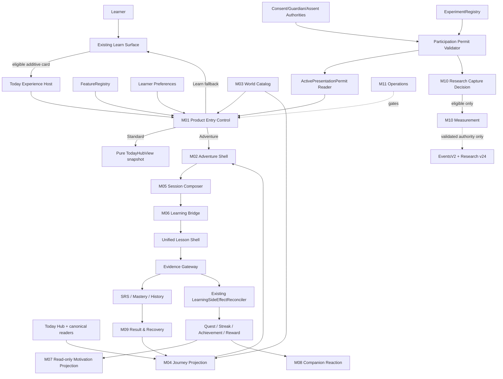
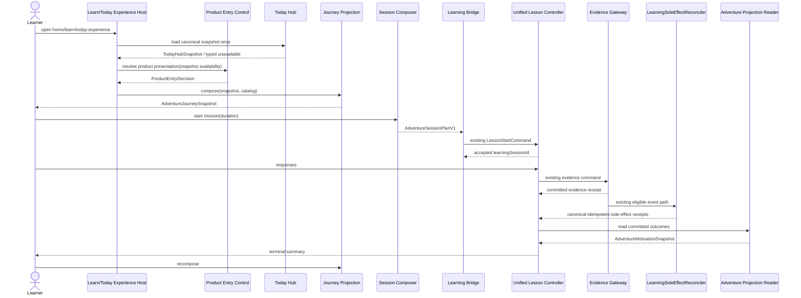
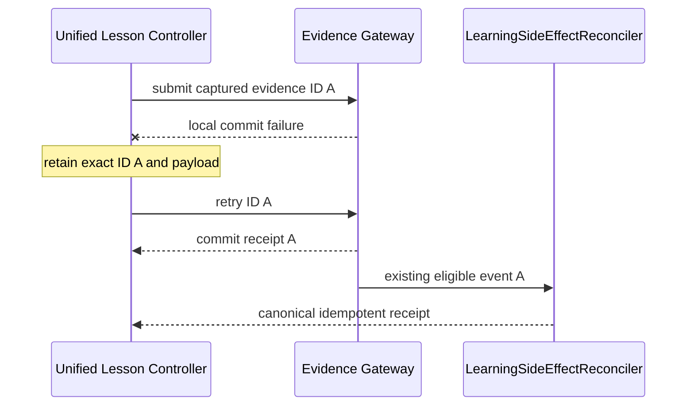

# Software Design Specification (SDS) — Adventure Motivation Mode

**Document ID:** LQ-AMM-SDS-001
**Version:** 1.3
**Status:** As-built local engineering verified; external device/UAT/research gates pending
**Date:** 2026-09-04; evidence update 2026-09-07
**SRS reference:** `LQ-AMM-SRS-001 v1.2`
**As-built baseline:** Research `ed89efaf`, locally verified Pair PM0–PM8 implementation `1875a618`, schema v24 / 48 tables; scoped local release checks and debug APK passed
**Historical product baseline:** product `f8a5f8bb`, hardening `703aabe4`, performance `85b17755`, local evidence `3c698cdd`, then schema v23
**Audit reference:** `AMM-AUDIT-001 v1.0`; local BG-01–BG-12 evidence has zero unclassified failure and retains explicit excluded/pending gates
**Decision references:** `LQ-AMM-ADR-001 v1.2`, `LQ-AMM-MDS-001 v1.2`

## 0. As-built scope and authority boundary

The historical product baseline implements M01–M09 and M11 for the approved
Adventure product extension. The as-built surface includes typed entry and
fallback, one canonical Today snapshot, deterministic Map/List projection,
session composition, the unchanged Unified Learning evidence bridge, repair
and recovery, read-only motivation receipts, scripted companion behavior,
bounded diagnostics, catalog quarantine/repair and Learner Preferences v2.

The mixed-review path presents typed recall, cloze, definition and flashcard
prompts through `AdventureMixedReviewController` and the canonical learning
bridge. Persisted checkpoint intent distinguishes a skipped flashcard repair
from exposure after restart; ambiguous legacy repair-flashcard checkpoints
fail closed. Session pins and exact pinned-query inputs are copied before
asynchronous work, owner configuration is persisted atomically, and cached
terminal results are checked against the canonical session summary before use.

Schema v23 introduced owner-scoped `homeExperience` and has migration,
lifecycle, sync, export, owner-merge and Firestore policy evidence. Adventure
adds no learning, reward, mastery, relationship or journey-progress authority.
The primary implementation and verification locations are
`lib/features/adventure/**`,
`lib/features/adventure/presentation/today_experience_host.dart`,
`lib/screens/today_hub_view.dart`,
`lib/data/local/tables/preference_tables.dart`, `test/features/adventure/**`
and
`docs/development/2026-09-04-adventure-motivation-checkpoint-6-local-verification.md`.

That historical hardened source passed 658 related regression tests and 3,542 complete
Flutter tests in each of default and serial modes. Four visually inspected
golden scenes cover typed recall, flashcard reveal at 200% text/reduced motion,
dark/high-contrast support and recovered Standard presentation. These are local
engineering results; the acceptance boundaries below still apply.

M10 research engineering is implemented at `ed89efaf`: schema v24 contains
48 tables, including four research lifecycle tables. Real enrollment/upload
remain default-off; supplied protocols, trusted issuers and valid receipts are
required at the collection/upload boundaries. See the
[Research engineering record](../development/2026-09-05-research-engineering-status.md).

M12 Pair Matching PM0–PM8 and design B — Playful Quest are authorized. The
implementation is independently reviewed at `1875a618`, including owner rehome,
compatibility, canonical close and composed evidence providers. Pair reuses f10 and
the existing canonical learning authorities. It adds no database migration,
main destination, reward balance or research authority. The
[Pair engineering record](../development/2026-09-05-pair-matching-engineering-status.md)
records phase evidence; the [PM8 verification record](../development/2026-09-07-pair-matching-pm8-local-verification.md)
tracks current release checks and artifact identity. Historical product
test totals and emulator results above do not verify the current Pair source.
Physical assistive technology, certified-device performance, learner UAT,
external G4P signatures and research efficacy remain separate acceptance gates.

## 1. Design Decision Summary

Adventure เป็น bounded context ที่ไม่มี write authority ต่อ learning/progress เดิม ประกอบด้วย M01–M11 และ M12 Pair Matching Prototype Integration ของ `f10` เดิม การเชื่อมระบบเดิมทำผ่าน application ports และ canonical use cases เท่านั้น สถานะ implementation และ external acceptance แยกตาม §0

การตัดสินใจที่ลดผลกระทบต่อ 8/44:

1. Learn surface เดิมไม่เปลี่ยนเมื่อ hidden; authorized entry เปิด `TodayExperienceHost` ซึ่ง load canonical Today snapshot หนึ่งครั้งแล้วเลือก Standard/Adventure presentation
2. Journey เป็น pure/rebuildable projection; ไม่มี Adventure progress table
3. Phase 1 shipped without schema migration
4. Preference v2 was subsequently implemented on the reserved schema v23 after shell/learning bridge acceptance
5. Research engineering uses the implemented schema v24; real enrollment/upload still require the independent research rollout gate
6. `EvidenceContext` และ learning-answer event ไม่เพิ่ม Adventure field
7. `AdventureOriginContextV1` เป็น transient launch context
8. Participant ทุก treatment ใช้ neutral events และ `MeasurementOpportunity`; nonparticipant zero-row ตาม ADR-003
9. Runtime flag, preference, assignment, participation permit และ raw consent records แยก repositories/ports
10. Existing static `LearningWorldMapScreen` ไม่ถูก reuse เป็น implementation

## 2. Architecture Views

### 2.1 Context view



### 2.2 Layer rule

```text
presentation  → application interfaces/use cases → domain models
                              ↓
                       data adapters
                              ↓
        existing authorities / Drift / outbox / assets
```

Forbidden dependencies:

- `lib/features/adventure/presentation/**` → `lib/data/local/**`
- Adventure → generated Drift row/data classes
- World catalog → Quest/Reward repository
- FeatureRegistry → Experiment assignment mutation
- Research measurement → learning correctness/mastery mutation

### 2.3 Authority matrix

| Fact | Authority | Adventure access |
|---|---|---|
| Content identity/revision | Vocabulary/Learning Pack | Read IDs/revisions |
| Answer correctness | Learning/Evidence | Submit through existing controller |
| Review due | SRS/Review | Read/launch |
| Mastery/weakness | Progress projection | Read-only |
| Quest | Quest | Process eligible event through use case |
| Streak | Gentle Streak | Process eligible event/read reaction |
| Achievement | Progress/Achievement | Read unlock result |
| XP/Coins/items | Reward | Typed idempotent command/read |
| Today work | Today Hub | Read and represent |
| Home presentation | LearnerPreferences v2 | Typed read/mutation |
| Experiment cohort | Experiment Registry | Permit issuer/validator reads exact assignment; Product Entry sees assignment only through active projection |
| Consent/guardian/assent | Existing authorities + approved enrollment | Validate signed participation permit; never exposed raw to Product Entry |
| Protocol treatment presentation | Active Presentation Permit projection | Product Entry read-only |
| Research opportunity denominator | Research schema v24 | Authority-gated transactional lifecycle |
| Journey position | Adventure Projection | Derived, never directly written |
| Motivation responses | Research schema v24 | Consent-aware use case |

## 3. Module Design

### 3.1 M01 — Delivery and Entry Control

**Files**

- `lib/features/adventure/domain/adventure_entry.dart`
- `lib/features/adventure/application/adventure_entry_use_cases.dart`
- modifications to `lib/runtime/registries/feature.dart`
- modifications to `lib/runtime/registries/feature_registry.dart`
- modifications to `lib/runtime/production_feature_contract.dart`
- modifications to `lib/runtime/app_dependencies.dart`

**Public domain contract**

```dart
enum TodayExperiencePresentation { standard, adventure }

enum AdventureEntryDestination { learn, standardToday, adventure }

enum AdventureAvailability {
  available,
  hidden,
  disabled,
  emergencyOff,
  missingDependency,
  invalidCatalog,
  contentUnavailable,
  assignmentConflict,
}

enum AdventureFallbackReason {
  none,
  learnerChoseStandard,
  featureUnavailable,
  dependencyUnavailable,
  catalogUnavailable,
  contentUnavailable,
  assignmentUnavailable,
  emergencyOff,
}

enum ResearchParticipantClass { adult, minor }

final class ResearchParticipationPermit {
  const ResearchParticipationPermit({
    required this.id,
    required this.ownerId,
    required this.participantClass,
    required this.ageBandCode,
    required this.assignmentId,
    required this.assignedTreatment,
    required this.consentReceiptId,
    required this.protocolId,
    required this.protocolVersion,
    required this.issuedAtUtc,
    required this.expiresAtUtc,
    required this.issuerKeyId,
    required this.payloadSha256,
    required this.signature,
    required this.localRevision,
    required this.cloudRevision,
    required this.isDeleted,
    this.guardianPermissionReceiptRef,
    this.learnerAssentReceiptRef,
    this.revokedAtUtc,
  });
  final String id;
  final String ownerId;
  final ResearchParticipantClass participantClass;
  final String ageBandCode;
  final String assignmentId;
  final TodayExperiencePresentation assignedTreatment;
  final String consentReceiptId;
  final String? guardianPermissionReceiptRef;
  final String? learnerAssentReceiptRef;
  final String protocolId;
  final String protocolVersion;
  final DateTime issuedAtUtc;
  final DateTime expiresAtUtc;
  final DateTime? revokedAtUtc;
  final String issuerKeyId;
  final String payloadSha256;
  final String signature;
  final int localRevision;
  final int cloudRevision;
  final bool isDeleted;
}

final class ActivePresentationPermit {
  const ActivePresentationPermit({
    required this.permitId,
    required this.ownerId,
    required this.assignedPresentation,
    required this.protocolId,
    required this.protocolVersion,
    required this.assignmentId,
    required this.expiresAtUtc,
  });
  final String permitId;
  final String ownerId;
  final TodayExperiencePresentation assignedPresentation;
  final String protocolId;
  final String protocolVersion;
  final String assignmentId;
  final DateTime expiresAtUtc;
}

final class AdventureEntryRequest {
  const AdventureEntryRequest({
    required this.ownerId,
    required this.entryAttemptId,
    required this.occurredAtUtc,
    this.sessionChoice,
    this.activePresentationPermit,
  });
  final String ownerId;
  final String entryAttemptId;
  final DateTime occurredAtUtc;
  final TodayExperiencePresentation? sessionChoice;
  final ActivePresentationPermit? activePresentationPermit;
}

final class AdventureProductEntryDecision {
  const AdventureProductEntryDecision({
    required this.entryAttemptId,
    required this.availability,
    required this.destination,
    required this.fallbackReason,
    required this.catalogVersion,
    this.permitId,
    this.assignmentId,
    this.treatment,
  });
  final String entryAttemptId;
  final AdventureAvailability availability;
  final AdventureEntryDestination destination;
  final AdventureFallbackReason fallbackReason;
  final String catalogVersion;
  final String? permitId;
  final String? assignmentId;
  final String? treatment;
}

abstract interface class AdventureProductEntryResolver {
  Future<AdventureProductEntryDecision> resolve(AdventureEntryRequest request);
}
```

**Decision precedence**

1. Noncanonical owner/time/UUID → reject input
2. hidden, disabled, unknown, emergency-off-before-Host หรือ unauthorized direct route → Learn; do not construct Host/snapshot
3. required Today dependency unavailable → Learn with bounded reason
4. valid `ActivePresentationPermit` → assigned treatment presentation; Standard escape remains
5. permit missing/invalid/expired/revoked → explicit session choice
6. no session choice → persisted preference v2
7. no choice/preference → Standard
8. catalog/content failure after Host authorization → Standard using the same snapshot

Product entry resolver is read-only. It cannot read raw consent/guardian/assent receipts, create assignment/permit or mutate preference. Host creates `entryAttemptId` once with the repository UUID v4 generator and reuses it across rebuild/retry/switch; it never enters learning evidence.

### 3.2 M02 — Experience Shell

**Files**

- `lib/features/adventure/presentation/adventure_hub_screen.dart`
- `lib/features/adventure/presentation/adventure_mission_sheet.dart`
- `lib/features/adventure/presentation/widgets/adventure_map.dart`
- `lib/features/adventure/presentation/widgets/adventure_map_list.dart`
- `lib/features/adventure/presentation/widgets/adventure_status_panel.dart`
- `lib/features/adventure/presentation/widgets/adventure_standard_switch.dart`

`AdventureHubScreen` receives immutable snapshot, callbacks and `FeatureRegistry`. It owns only transient UI state: map/list selection, loading flags, focus target and visible sheet. It never receives a database object.

```dart
abstract interface class AdventureActionDelegate {
  Future<void> startMission(AdventureMissionRef mission);
  Future<void> resumeMission(String learningSessionId);
  Future<void> switchToStandard({required bool rememberChoice});
  Future<void> refresh();
  Future<void> repairAssets();
}
```

Each callback is guarded by a per-action in-flight set. Feature state is rechecked immediately before invocation to handle live emergency-off.

### 3.3 M03 — World, Story and Asset Catalog

**Files**

- `lib/features/adventure/domain/adventure_world_catalog.dart`
- `lib/features/adventure/data/packaged_adventure_world_catalog.dart`
- `lib/features/adventure/data/adventure_world_catalog_validator.dart`
- `assets/adventure/world_v1/catalog.th.json`
- `assets/adventure/world_v1/catalog.en.json`
- `assets/adventure/world_v1/manifest.json`

**Core types**

```dart
enum AdventureCatalogQaState { draft, internalApproved, pilotApproved }
enum AdventureNodeKind { resume, review, mission, rewardPreview }

final class AdventureWorldCatalog {
  const AdventureWorldCatalog({
    required this.schemaVersion,
    required this.catalogId,
    required this.catalogVersion,
    required this.locale,
    required this.qaState,
    required this.worlds,
    required this.reactions,
    required this.assetManifest,
  });
  static const int currentSchemaVersion = 1;
  final int schemaVersion;
  final String catalogId;
  final String catalogVersion;
  final String locale;
  final AdventureCatalogQaState qaState;
  final List<AdventureWorldDefinition> worlds;
  final List<CompanionScriptDefinition> reactions;
  final AdventureAssetManifest assetManifest;
}
```

Validator checks canonical IDs, exact allowed keys, version, QA state, duplicate IDs, prerequisite resolution, cycles, string/rune bounds, locale parity, asset path safety, SHA-256 and byte size. Invalid catalog is never partially accepted.

The initial graph is linear and contains exactly three learner-visible nodes: Resume/Review if applicable, Today Mission, Next Preview. The same definitions include list labels.

### 3.4 M04 — Journey Projection

**Files**

- `lib/features/adventure/domain/adventure_journey.dart`
- `lib/features/adventure/application/adventure_journey_reader.dart`

```dart
enum AdventureNodeState {
  hidden,
  locked,
  available,
  current,
  completed,
  unavailable,
}

final class AdventureJourneyRequest {
  const AdventureJourneyRequest({
    required this.ownerId,
    required this.evaluatedAtUtc,
    required this.catalog,
    required this.today,
  });
  final String ownerId;
  final DateTime evaluatedAtUtc;
  final AdventureWorldCatalog catalog;
  final TodayHubSnapshot today;
}

abstract interface class AdventureJourneyReader {
  Future<AdventureJourneySnapshot> compose(AdventureJourneyRequest request);
}
```

Projection algorithm v1:

1. Validate owner and version coherence
2. Resolve resumable session; if present, set resume node `current`
3. Resolve due Review items by canonical content identity
4. Resolve Today recommendation and reason
5. Read canonical Quest/Streak/Achievement/Reward/History summaries
6. Map facts to catalog presentation rules
7. Mark dependent nodes unavailable when one reader is unavailable/corrupt
8. Select exactly one primary mission: resume > assigned nonreward assessment in Standard only > due review > recommendation
9. Return immutable snapshot with input fingerprints

Assessment can appear as a neutral assigned-work card in Standard but is not converted to Adventure mission or reward node.

No cache is implemented in this scope.

### 3.5 M05 — Session Composer

**Files**

- `lib/features/adventure/domain/adventure_session_plan.dart`
- `lib/features/adventure/application/adventure_session_composer.dart`

```dart
final class AdventureOriginContextV1 {
  const AdventureOriginContextV1({
    required this.planId,
    required this.nodeId,
    required this.catalogId,
    required this.catalogVersion,
    required this.presentation,
  });
  static const int schemaVersion = 1;
  final String planId;
  final String nodeId;
  final String catalogId;
  final String catalogVersion;
  final TodayExperiencePresentation presentation;
}

final class AdventureSessionPlanV1 {
  const AdventureSessionPlanV1({
    required this.planId,
    required this.ownerId,
    required this.createdAtUtc,
    required this.sourceEvaluatedAtUtc,
    required this.content,
    required this.mode,
    required this.configuration,
    required this.recommendationPolicyVersion,
    required this.origin,
    this.assignmentId,
    this.treatment,
  });
  final String planId;
  final String ownerId;
  final DateTime createdAtUtc;
  final DateTime sourceEvaluatedAtUtc;
  final List<ContentIdentity> content;
  final LessonMode mode;
  final SessionConfiguration configuration;
  final String recommendationPolicyVersion;
  final AdventureOriginContextV1 origin;
  final String? assignmentId;
  final String? treatment;
}

abstract interface class AdventureSessionComposer {
  Future<AdventureSessionPlanV1> compose({
    required AdventureMissionRef mission,
    required TodayHubSnapshot today,
    required SessionConfiguration requestedConfiguration,
    required AdventureProductEntryDecision entry,
  });
}
```

`planId` is a deterministic hash/ID derived from owner, source evaluation instant, mission/node, ordered content identities, mode/configuration and catalog/treatment versions. Repeated identical input cannot create a logically different plan.

### 3.6 M06 — Learning Bridge

**Files**

- `lib/features/adventure/application/adventure_learning_bridge.dart`

```dart
final class AdventureLessonLaunch {
  const AdventureLessonLaunch({
    required this.plan,
    required this.controller,
    required this.startCommand,
  });
  final AdventureSessionPlanV1 plan;
  final UnifiedLessonController controller;
  final LessonStartCommand startCommand;
}

abstract interface class AdventureLearningBridge {
  Future<AdventureLessonLaunch> prepare(AdventureSessionPlanV1 plan);
}
```

The bridge:

1. Revalidates feature and owner
2. Revalidates content/configuration versions
3. Creates existing controller through `UnifiedLessonControllerFactory`
4. Builds the same `LessonStartCommand` that Standard mode uses
5. Keeps `AdventureOriginContextV1` beside the launch only
6. Never adds Adventure fields to `EvidenceContext`, `LearningEventContext`, `AnswerAttempts` or learning event payload
7. Hands session ID to consent-aware behavior recorder after start acceptance

This yields a strong equivalence test: for the same canonical work/configuration, Standard and Adventure start commands and subsequent answer evidence are equal except for transient UI wrapper objects.

### 3.7 M07 — Motivation and Unlock Projection Reader

**Files**

- `lib/features/adventure/application/adventure_motivation_projection_reader.dart`

```dart
enum AdventureProjectionReceiptState { pending, committed, notEligible }

final class AdventureProjectionOutcome {
  const AdventureProjectionOutcome({
    required this.state,
    this.receiptId,
    this.displayCode,
  });
  final AdventureProjectionReceiptState state;
  final String? receiptId;
  final String? displayCode;
}

final class AdventureMotivationSnapshot {
  const AdventureMotivationSnapshot({
    required this.sourceEvidenceId,
    required this.questOutcome,
    required this.streakOutcome,
    required this.rewardOutcome,
    required this.pendingProjection,
  });
  final String sourceEvidenceId;
  final AdventureProjectionOutcome questOutcome;
  final AdventureProjectionOutcome streakOutcome;
  final AdventureProjectionOutcome rewardOutcome;
  final bool pendingProjection;
}

abstract interface class AdventureMotivationProjectionReader {
  Future<AdventureMotivationSnapshot> readForEvidence(String evidenceId);
}
```

Eligibility, mutation and idempotency remain entirely inside the existing evidence policy and `LearningSideEffectReconciler`. Adventure reads committed receipts/projections after learning completion; it neither accepts an `EventEnvelopeV2` for mutation nor constructs a reward idempotency key. A missing projection is displayed as pending and left to the canonical reconciler/outbox.

Assessment, research-presentation, recreational, map-open and other behavioral events are not reward eligible.

### 3.8 M08 — Companion, Avatar and Narrative Reaction

**Files**

- `lib/features/adventure/domain/adventure_reaction.dart`
- `lib/features/adventure/application/adventure_reaction_selector.dart`
- `lib/features/adventure/presentation/widgets/adventure_companion_panel.dart`

Reaction selection is a pure mapping of committed state code + catalog version + deterministic variant seed. Allowed inputs: session start, independent correct, guided correct, incorrect, skip, return, completion, pending reward, recovered error. It cannot consume raw answer text.

```dart
enum AdventureReactionTrigger {
  missionReady,
  independentCorrect,
  guidedCorrect,
  incorrect,
  skipped,
  resumed,
  completed,
  rewardPending,
  recovered,
}
```

`CompanionScriptDefinition` includes Thai/English keys, visual pose ID, motion ID or `none`, audio asset ID or `none`, accessible text key and mastery-claim classification. Validator rejects shame/forbidden tokens through an allowlisted content review process plus human approval; automated scan is a guard, not the sole copy approval.

### 3.9 M09 — Result, Recovery and Review Continuity

**Files**

- `lib/features/adventure/domain/adventure_result.dart`
- `lib/features/adventure/application/adventure_mixed_review_controller.dart`
- `lib/features/adventure/application/adventure_mixed_review_prompt_catalog.dart`
- `lib/features/adventure/application/adventure_recovery_use_cases.dart`
- `lib/features/adventure/application/adventure_repair_policy.dart`
- `lib/features/adventure/presentation/adventure_mixed_review_screen.dart`
- `lib/features/adventure/presentation/adventure_result_screen.dart`

```dart
final class AdventureResultSnapshot {
  const AdventureResultSnapshot({
    required this.learning,
    required this.effort,
    required this.engagement,
    required this.rewardState,
    required this.nextAction,
  });
  final AdventureLearningResult learning;
  final AdventureEffortResult effort;
  final AdventureEngagementResult engagement;
  final AdventureRewardProjectionState rewardState;
  final AdventureNextAction nextAction;
}
```

Repair policy accepts an item only when at least three eligible distinct intervening positions occurred. It schedules at position 3–5 deterministically, permits one repair per content identity in the session and defers to Review/SRS when fewer than three positions remain. It never pads a session.

Recovery uses existing resumable session authority. A persisted Adventure preference or assigned treatment causes the resumed session to be represented as current Adventure node; the learning session itself remains unaware of presentation origin.

### 3.10 M10 — Research and Experiment Measurement

**Files**

- `lib/features/research/domain/motivation_instrument.dart`
- `lib/features/research/domain/motivation_measurement.dart`
- `lib/features/research/domain/motivation_measurement_repository.dart`
- `lib/features/research/application/motivation_measurement_use_cases.dart`
- `lib/features/research/application/adventure_behavior_event_recorder.dart`
- `lib/features/research/data/drift_motivation_measurement_repository.dart`
- `lib/features/events/domain/adventure_event_payload_policy.dart`

```dart
abstract interface class ResearchParticipationPermitValidator {
  Future<ActivePresentationPermit?> validate({
    required String ownerId,
    required DateTime occurredAtUtc,
  });
}

final class MeasurementOpportunity {
  const MeasurementOpportunity({
    required this.id,
    required this.ownerId,
    required this.measurementRunId,
    required this.permitId,
    required this.entryAttemptId,
    required this.assignedTreatment,
    required this.effectivePresentation,
    required this.lastSwitchOrdinal,
    required this.suppressedSwitchCount,
    required this.openedAtUtc,
    this.presentedEventId,
    this.learningSessionId,
    this.startedEventId,
    this.completedEventId,
    this.closedAtUtc,
  });
  final String id;
  final String ownerId;
  final String measurementRunId;
  final String permitId;
  final String entryAttemptId;
  final TodayExperiencePresentation assignedTreatment;
  final TodayExperiencePresentation effectivePresentation;
  final String? presentedEventId;
  final String? learningSessionId;
  final String? startedEventId;
  final String? completedEventId;
  final int lastSwitchOrdinal;
  final int suppressedSwitchCount;
  final DateTime openedAtUtc;
  final DateTime? closedAtUtc;
}

enum ResearchCaptureReason {
  eligible,
  noPermit,
  invalidPermit,
  expiredPermit,
  revokedPermit,
  noActiveRun,
  withdrawn,
  versionConflict,
  ownerConflict,
}

final class ResearchCaptureDecision {
  const ResearchCaptureDecision({
    required this.isEligible,
    required this.reason,
    this.measurementRunId,
    this.assignmentId,
    this.permitId,
  });
  final bool isEligible;
  final ResearchCaptureReason reason;
  final String? measurementRunId;
  final String? assignmentId;
  final String? permitId;
}

abstract interface class ResearchCaptureGate {
  Future<ResearchCaptureDecision> evaluate({
    required ActivePresentationPermit permit,
    required String measurementRunId,
    required String entryAttemptId,
  });
}

enum MotivationMeasurementRunState {
  started,
  completed,
  skipped,
  abandoned,
  withdrawn,
}

abstract interface class MotivationMeasurementRepository {
  Future<MotivationMeasurementRun> start(
    MotivationMeasurementStart command,
  );
  Future<MotivationMeasurementRun> record(
    MotivationResponse response,
  );
  Future<MotivationMeasurementRun> close(
    MotivationMeasurementClose command,
  );
  Future<MotivationMeasurementRun?> load(String ownerId, String runId);
}

abstract interface class MeasurementOpportunityRepository {
  Future<MeasurementOpportunity> open(MeasurementOpportunity command);
  Future<MeasurementOpportunity> recordPresented(String opportunityId);
  Future<MeasurementOpportunity> changePresentation(
    String opportunityId,
    TodayExperiencePresentation presentation,
  );
  Future<MeasurementOpportunity> attachAcceptedSession(
    String opportunityId,
    String learningSessionId,
  );
  Future<MeasurementOpportunity> close(String opportunityId);
}
```

Behavior recorder creates only four event types, each eventVersion 1:

| Event | Aggregate | Required bounded payload |
|---|---|---|
| `TodayExperiencePresented` | `MeasurementOpportunity` / opportunityId | assignedTreatment, effectivePresentation, entryAttemptId, catalog/version |
| `TodayExperienceMissionStarted` | `LearningSession` / learningSessionId | opportunityId, assignedTreatment, effectivePresentation, planId, mode |
| `TodayExperiencePresentationChanged` | `MeasurementOpportunity` / opportunityId | assignedTreatment, effectivePresentation, fromPresentation, switchOrdinal 1–10 |
| `TodayExperienceMissionCompleted` | `LearningSession` / learningSessionId | opportunityId, assignedTreatment, effectivePresentation, planId, terminalState |

All payloads use catalog-owned codes and bounded integers. Standard และ Adventure emit event types เดียวกัน. Opportunity opens before Presented and is the independent denominator. Presentation change updates `lastSwitchOrdinal` transactionally for 1–10; later attempts only increment `suppressedSwitchCount`. Mission events require accepted `learningSessionId` and the same opportunity ID. Recorder runs only when the signed permit and measurement run remain active; otherwise it produces zero new event/outbox/upload and product learning continues through session choice/preference/Standard.

### 3.11 M11 — Operations, Quality and Reliability

**Files**

- `lib/features/adventure/application/adventure_diagnostics.dart`
- `lib/features/adventure/application/adventure_rollout_gate.dart`
- validation scripts/tests under `tool/adventure/` and `test/features/adventure/`

Diagnostics expose only counters and bounded reason codes. No raw owner ID, answer, response or story text. Rollout gate consumes signed/committed evidence artifacts and cannot set assignment.

## 4. Data Design

### 4.1 As-built schema v23 — preference v2

`v23` was the next free ledger number and is now the implemented current
schema. The generated Drift code, v22→v23 migration and compatibility tests
are part of the local verification evidence.

Modify `lib/data/local/tables/preference_tables.dart`:

```dart
TextColumn get homeExperience =>
    text().withDefault(const Constant('standard'))();
```

Domain additions in `learner_preferences.dart`:

```dart
enum HomeExperience { standard, adventure }

abstract final class HomeExperienceCodec {
  static HomeExperience parse(String value) => switch (value) {
    'standard' => HomeExperience.standard,
    'adventure' => HomeExperience.adventure,
    _ => HomeExperience.standard,
  };
}
```

Parsing unknown serialized value returns Standard for presentation safety and records a bounded diagnostic; sync validation still rejects unknown payload rather than normalizing and overwriting it.

Migration rules:

- add column with default `standard`
- set stored `preference_version = 2`
- preserve all v1 fields byte/value-equivalent
- v2 domain writes always include `homeExperience`
- v1 cloud payload is upgraded to Standard in memory, then persisted as v2 only through normal conflict policy
- old clients must not be allowed to overwrite v2 with a v1 mutation after server compatibility cutoff

### 4.2 Implemented schema v24 — research measurement

Schema v24 is implemented at Research source `ed89efaf`. The executable
definitions in `lib/data/local/tables/research_tables.dart` and migrations in
`lib/data/local/app_database.dart` are authoritative. The original design
sketch below describes responsibilities; it is not executable DDL or a complete
replacement for the current field/constraint definitions. No version is newly
reserved for Pair Matching.

Original four-table design sketch:

```text
motivation_measurement_runs
  id TEXT PRIMARY KEY
  owner_id TEXT NOT NULL REFERENCES local_owners(id) ON DELETE CASCADE
  assignment_id TEXT NOT NULL REFERENCES experiment_assignments(id)
  consent_version INTEGER NOT NULL CHECK > 0
  consent_decided_at_utc_ms INTEGER NOT NULL CHECK >= 0
  protocol_id TEXT NOT NULL
  protocol_version TEXT NOT NULL
  treatment TEXT NOT NULL
  instrument_id TEXT NOT NULL
  instrument_version TEXT NOT NULL
  form_id TEXT NOT NULL
  form_version TEXT NOT NULL
  app_version TEXT NOT NULL
  build_id TEXT NOT NULL
  database_schema_version INTEGER NOT NULL
  content_revision TEXT NOT NULL
  evidence_policy_version TEXT NOT NULL
  state TEXT NOT NULL
  started_at_utc_ms INTEGER NOT NULL
  closed_at_utc_ms INTEGER NULL
  local_revision INTEGER NOT NULL DEFAULT 1
  cloud_revision INTEGER NOT NULL DEFAULT 0
  last_acknowledged_at_utc_ms INTEGER NULL
  server_updated_at_utc_ms INTEGER NULL
  is_deleted INTEGER NOT NULL DEFAULT 0

motivation_responses
  id TEXT PRIMARY KEY
  owner_id TEXT NOT NULL REFERENCES local_owners(id) ON DELETE CASCADE
  run_id TEXT NOT NULL REFERENCES motivation_measurement_runs(id) ON DELETE CASCADE
  item_id TEXT NOT NULL
  item_catalog_version TEXT NOT NULL
  response_code TEXT NOT NULL
  ordinal_value INTEGER NULL
  answered_at_utc_ms INTEGER NOT NULL
  local_revision INTEGER NOT NULL DEFAULT 1
  cloud_revision INTEGER NOT NULL DEFAULT 0
  last_acknowledged_at_utc_ms INTEGER NULL
  server_updated_at_utc_ms INTEGER NULL
  is_deleted INTEGER NOT NULL DEFAULT 0
  UNIQUE(owner_id, run_id, item_id)

research_participation_permits
  id TEXT PRIMARY KEY
  owner_id TEXT NOT NULL REFERENCES local_owners(id) ON DELETE CASCADE
  participant_class TEXT NOT NULL CHECK(participant_class IN ('adult','minor'))
  age_band_code TEXT NOT NULL
  assignment_id TEXT NOT NULL REFERENCES experiment_assignments(id)
  assigned_treatment TEXT NOT NULL CHECK(assigned_treatment IN ('standard','adventure'))
  consent_receipt_id TEXT NOT NULL
  guardian_permission_receipt_ref TEXT NULL
  learner_assent_receipt_ref TEXT NULL
  protocol_id TEXT NOT NULL
  protocol_version TEXT NOT NULL
  issued_at_utc_ms INTEGER NOT NULL
  expires_at_utc_ms INTEGER NOT NULL
  revoked_at_utc_ms INTEGER NULL
  issuer_key_id TEXT NOT NULL
  payload_sha256 TEXT NOT NULL
  signature TEXT NOT NULL
  local_revision INTEGER NOT NULL DEFAULT 1
  cloud_revision INTEGER NOT NULL DEFAULT 0
  last_acknowledged_at_utc_ms INTEGER NULL
  server_updated_at_utc_ms INTEGER NULL
  is_deleted INTEGER NOT NULL DEFAULT 0
  CHECK(participant_class = 'adult' OR
        (guardian_permission_receipt_ref IS NOT NULL AND
         learner_assent_receipt_ref IS NOT NULL))

measurement_opportunities
  id TEXT PRIMARY KEY
  owner_id TEXT NOT NULL REFERENCES local_owners(id) ON DELETE CASCADE
  measurement_run_id TEXT NOT NULL REFERENCES motivation_measurement_runs(id) ON DELETE CASCADE
  permit_id TEXT NOT NULL REFERENCES research_participation_permits(id)
  entry_attempt_id TEXT NOT NULL
  assigned_treatment TEXT NOT NULL CHECK(assigned_treatment IN ('standard','adventure'))
  effective_presentation TEXT NOT NULL CHECK(effective_presentation IN ('standard','adventure'))
  presented_event_id TEXT NULL
  learning_session_id TEXT NULL
  started_event_id TEXT NULL
  completed_event_id TEXT NULL
  last_switch_ordinal INTEGER NOT NULL DEFAULT 0 CHECK(last_switch_ordinal BETWEEN 0 AND 10)
  suppressed_switch_count INTEGER NOT NULL DEFAULT 0 CHECK(suppressed_switch_count >= 0)
  opened_at_utc_ms INTEGER NOT NULL
  closed_at_utc_ms INTEGER NULL
  local_revision INTEGER NOT NULL DEFAULT 1
  cloud_revision INTEGER NOT NULL DEFAULT 0
  last_acknowledged_at_utc_ms INTEGER NULL
  server_updated_at_utc_ms INTEGER NULL
  is_deleted INTEGER NOT NULL DEFAULT 0
  UNIQUE(owner_id, measurement_run_id, permit_id, entry_attempt_id)
```

All identifiers use canonical length/pattern validation. Response code must be declared by the pinned item catalog. No text response column exists. แอปไม่เก็บ full DOB หรือ guardian PII; permit เก็บเพียง age-band code และ opaque receipt references. Permit/opportunity tables ต้องเข้ากฎ owner lifecycle, sync, Firestore rules, export, withdrawal, deletion และ retention manifest ทุกจุด

### 4.3 No Adventure progress table

No table named or semantically equivalent to `adventure_progress`, node completion, companion relationship or story choice is allowed. `AdventureJourneySnapshot` exists only in memory. Future cache requires a separate approved spec and must be disposable.

### 4.4 Lifecycle integration

Schema v23 updated preference paths and Research schema v24 implemented the
four-table lifecycle in these cross-cutting authorities. Research engineering
evidence is recorded separately from the historical product implementation:

- `lib/features/identity/domain/owner_lifecycle_manifest.dart`
- `lib/features/identity/data/drift_owner_upgrade_repository.dart`
- `lib/features/sync/domain/sync_entity.dart`
- `lib/features/sync/data/drift_sync_store.dart`
- `lib/features/export/data/drift_export_reader.dart`
- `lib/features/export/application/owner_lifecycle_archive.dart`
- Firestore rules and emulator tests

Each of the four research tables appears exactly once in the lifecycle/retention manifest. Preference is an extension of its existing entity, not a new lifecycle entity. Withdrawal/revocation invalidates active projection before the next Host/start/capture operation; deletion order removes opportunities before permits/runs while preserving global content.

## 5. Sequence Designs

### 5.1 Normal mission



### 5.2 Evidence fails, reward does not run



### 5.3 Research exposure

```mermaid
sequenceDiagram
  participant UI as Today Experience Host
  participant P as Participation Permit Validator
  participant R as Research Capture Gate/Recorder
  participant O as Opportunity Repository
  participant E as EventsV2 Store
  UI->>P: validate(owner, time)
  P-->>UI: ActivePresentationPermit or null
  alt active permit and matching run
    UI->>O: open once(permit, entryAttemptId, assigned/effective)
    O-->>UI: MeasurementOpportunity
    UI->>R: neutral candidate(opportunity/session)
    R->>E: idempotent EventEnvelopeV2 + payload v1
    R->>O: attach event/session IDs transactionally
  else nonparticipant or invalid/withdrawn permit
    P-->>UI: no protocol treatment; zero opportunity/event/outbox/upload
    UI-->>UI: session choice → preference → Standard; product learning continues
  end
```

## 6. Error and Recovery Design

| Failure | Detection | Persisted effect | UX | Recovery |
|---|---|---|---|---|
| Feature hidden/off or stale route | Registry/navigation gate | None | Return Learn | Operator changes flag after gate |
| Missing dependency before authorization | Entry dependency check | Diagnostic counter only | Return Learn + brief reason | Retry on next authorized entry |
| Invalid catalog | Validator/checksum | Quarantine state via Offline Manager | Standard + repair | Verify/repair/remove |
| Stale journey | Source fingerprint | None | Stale label; unsafe CTA disabled | Recompose |
| Plan owner/version mismatch | Composer/bridge | None | Refresh required | Reload Today snapshot |
| Evidence write fails | Existing controller/store | Pending exact capture | Do not show reward completion | Exact retry |
| Reward projection fails | Canonical reconciler/receipt | Evidence kept; projection pending | Learning success + reward pending | Existing reconciler/outbox retries idempotently; Adventure only refreshes read model |
| Permit invalid/expired/revoked or withdrawal | Permit validator | No new opportunity/event | Product continues via session choice/preference/Standard | Renew permit or export/delete per policy |
| Assignment conflict | Permit validator | No event/reassignment | Product fallback; no protocol treatment | Approved enrollment resolution |
| Kill switch mid-session | Registry listener | Accepted learning remains | Safe close, Standard | Re-enable only after review |

No automatic retry loops are unbounded. UI retries are user-triggered or use existing bounded outbox/backoff policy.

## 7. Accessibility Design

- `Semantics(container: true)` for each node group
- one interactive semantic action per node; decorative path excluded
- list view built from same `AdventureNodeSnapshot` and delegates
- semantic labels include node state and reason, e.g. “ภารกิจวันนี้ พร้อมเริ่ม ใช้เวลาประมาณ 10 นาที”
- focus order defined with `FocusTraversalGroup`/ordered traversal where necessary
- `MediaQuery.disableAnimations` plus saved motion preference feeds `M3Theme.motionDuration`
- completed/current/locked use icon + text + shape
- 200% text switches cards to vertical layout; CTA remains full width
- audio is never the only carrier of story or feedback
- no gesture-only actions; every swipe/drag alternative has button/action
- Research Prompt, guardian permission, learner assent and invalid-permit dialog use logical heading/body/actions, announce status once and restore focus to the invoking control
- TalkBack, Switch Access/keyboard and text 200% must reach Skip/Not now/withdraw and no-learning-impact copy without timeout or focus trap

## 8. Security, Privacy and Abuse Resistance

This section uses bounded local controls; no repository-wide security worker is part of this project.

### 8.1 Input and identity

- canonical nonblank IDs, bounded rune length
- owner read before composition and revalidated before mutation
- mixed-owner data rejected
- exact allowlist for event/catalog JSON keys
- path traversal blocked in asset manifest
- SHA-256 checksum and declared byte size verified

### 8.2 Authorization and consent

- Firestore rules require authenticated owner match
- experiment assignment cannot be client-mutated through Adventure
- permit signature, owner, assignment, active consent, guardian/assent when minor, protocol, expiry, revocation and revision checked before projection/capture and again at cloud rules boundary
- withdrawal blocks enqueue before transport
- operator flags cannot grant consent, assent, permission or active permit

### 8.3 Data minimization

- no raw answer in neutral Today Experience event payload
- no free-text motivation response
- no raw story text in diagnostics
- non-participant receives no research opportunity row or neutral research event
- no full DOB or guardian PII; only age-band code and opaque receipt references
- version pins are IDs/hashes, not copied content

### 8.4 Economy abuse

- map open/story view not eligible
- source evidence causation required
- deterministic idempotency keys
- assessment excluded
- restart/replay duplicate rejection

## 9. Performance Design

- compose Today Hub once per refresh; pass snapshot downstream
- projection is O(nodes + canonical summaries), v1 nodes bounded to 3 visible
- catalog parsed/validated once per version per process; no durable journey cache
- use `const` widgets and keyed node subtrees
- avoid large raster maps; v1 uses vector/simple packaged assets
- defer downloadable audio and nonessential art
- record research asynchronously after session acceptance; never block answer feedback
- use existing outbox/background sync backoff

## 10. Composition Root and Navigation

Modify `AppDependencies` to add nullable Adventure facade during hidden phases:

```dart
final AdventureProductEntryResolver? adventureEntry;
final AdventureJourneyReader? adventureJourney;
final AdventureSessionComposer? adventureSessions;
final AdventureLearningBridge? adventureLearning;
final AdventureMotivationProjectionReader? adventureMotivation;
```

`hasComposedDependencyFor(Feature.adventureMotivation)` returns true only when required facade dependencies and Today Hub/Learning core are identity-consistent.

Navigation strategy:

- Keep existing bottom navigation and Learn destination identity unchanged
- Register stable child route `home/learn/today-experience`; no new bottom tab
- Show one additive Learn card only when feature/dependencies are eligible; hidden path leaves Learn layout baseline-equivalent
- `TodayExperienceHost` authorizes entry, creates/reuses one UUID v4 `entryAttemptId`, calls `TodayHubSnapshotLoader.load()` exactly once, then resolves active permit/session choice/preference
- Refactor Standard presentation into pure `TodayHubView(snapshot)`; keep `TodayHubScreen` as the legacy destination loader wrapper; Adventure uses `AdventureHubScreen(snapshot)`
- Standard/Adventure switch and rebuild use the same snapshot object/fingerprint; only explicit refresh starts a new Host opening and ID
- Hidden/disabled/unknown or stale direct route returns Learn without constructing Host/snapshot; Standard fallback is limited to an already authorized Host
- Standard switch replaces presentation within Today destination rather than stacking duplicate home routes
- System Back from the host returns to Learn
- Accepted lesson is still pushed through existing `AppNavigator`/registered lesson routes

## 11. Planned File Map

### New production files

```text
lib/features/adventure/
  domain/
    adventure_entry.dart
    adventure_world_catalog.dart
    adventure_journey.dart
    adventure_session_plan.dart
    adventure_reaction.dart
    adventure_result.dart
  application/
    adventure_entry_use_cases.dart
    adventure_journey_reader.dart
    adventure_session_composer.dart
    adventure_learning_bridge.dart
    adventure_motivation_projection_reader.dart
    adventure_reaction_selector.dart
    adventure_repair_policy.dart
    adventure_recovery_use_cases.dart
    adventure_diagnostics.dart
    adventure_rollout_gate.dart
  data/
    packaged_adventure_world_catalog.dart
    adventure_world_catalog_validator.dart
  presentation/
    adventure_today_entry_card.dart
    today_experience_host.dart
    adventure_hub_screen.dart
    adventure_mission_sheet.dart
    adventure_result_screen.dart
    widgets/
      adventure_map.dart
      adventure_map_list.dart
      adventure_status_panel.dart
      adventure_standard_switch.dart
      adventure_companion_panel.dart
```

### New/extended research files

```text
lib/features/research/domain/motivation_instrument.dart
lib/features/research/domain/motivation_measurement.dart
lib/features/research/domain/motivation_measurement_repository.dart
lib/features/research/domain/research_participation_permit.dart
lib/features/research/domain/measurement_opportunity.dart
lib/features/research/application/motivation_measurement_use_cases.dart
lib/features/research/application/research_participation_permit_validator.dart
lib/features/research/application/measurement_opportunity_use_cases.dart
lib/features/research/application/adventure_research_capture_gate.dart
lib/features/research/application/adventure_behavior_event_recorder.dart
lib/features/research/data/drift_motivation_measurement_repository.dart
lib/features/events/domain/adventure_event_payload_policy.dart
```

### Existing files modified

```text
lib/runtime/registries/feature.dart
lib/runtime/registries/feature_registry.dart
lib/runtime/production_feature_contract.dart
lib/runtime/app_dependencies.dart
lib/runtime/app_bootstrap.dart
lib/screens/main_navigation_screen.dart
lib/screens/today_hub_screen.dart
lib/screens/today_hub_view.dart
lib/features/preferences/domain/learner_preferences.dart
lib/features/preferences/application/learner_preferences_use_cases.dart
lib/features/preferences/data/drift_learner_preferences_repository.dart
lib/data/local/tables/preference_tables.dart
lib/data/local/tables/research_tables.dart
lib/data/local/app_database.dart
lib/features/identity/domain/owner_lifecycle_manifest.dart
lib/features/identity/data/drift_owner_upgrade_repository.dart
lib/features/sync/domain/sync_entity.dart
lib/features/sync/data/drift_sync_store.dart
lib/features/export/data/drift_export_reader.dart
lib/features/export/application/owner_lifecycle_archive.dart
firestore.rules
```

`lib/data/local/app_database.g.dart` is generated only through Drift build tooling.

## 12. Test Architecture

New tests mirror production modules under `test/features/adventure/`. Cross-domain invariants live under `test/architecture/` and full journeys under `test/scenarios/`.

Required test layers:

1. Pure domain validation
2. Application use-case unit tests with fakes
3. Drift repository/migration tests
4. Widget/semantics/golden tests
5. Cross-authority integration tests
6. Restart/offline/emergency-off scenarios
7. Firestore emulator rules tests
8. Export/delete/guest-upgrade lifecycle scenarios
9. Manual accessibility/device certification
10. UAT

### 12.1 Performance rehearsal implementation

`integration_test/adventure_performance_profile_test.dart` measures the
approved local entry, journey projection, first meaningful render, paired
Adventure-minus-Standard start overhead, and Map/List budgets in profile mode.
Every one of 20 settled Map/List transitions must contribute a real Flutter
build/raster frame; bounded Dart timeline aggregates are retained without raw
event payloads. The untimed check uses the production
`UnifiedLessonController` with its injected monotonic clock and the same
`Timeout.none` value declared on the test.

`tool/cli/run-adventure-performance-profile.ps1` validates the complete profile
schema and takes content-clean Git snapshots before and after Flutter Drive.
Changed HEAD, staged/unstaged content, non-ignored untracked files, malformed
metrics, scalar arrays or inconsistent pass flags fail closed. At source
`85b17755`, the Android 15 Pixel 6 host-GPU emulator rehearsal passed all
budgets, including Map/List frame p95 4.290 ms and maximum 7.031 ms. Its
evidence class is explicitly `emulator_rehearsal` / `not_certified`; physical
device certification remains Test Architecture layer 9.

## 13. Deployment and Rollback

### Hidden

- Code and schema migration can ship only after compatibility tests and closure of Audit “before implementation” gates
- registry default hidden
- no learner navigation entry
- diagnostics local/internal only

### Internal

- explicit runtime state limited/internal
- staff profiles only
- scripted world v1
- research upload remains off unless internal protocol explicitly consented

### Pilot

- MS-08A feasibility cohort with valid adult/minor permits
- stable assignment, permit, opportunity and version completeness 100%
- emergency-off verified
- Standard escape always available
- maximum state after gate is `Limited`; no efficacy claim

### Controlled Expansion

- requires class-specific MS-08B powered sample and all MDS thresholds
- adult/minor eligibility is isolated; one class cannot unlock the other

### Enabled

- follows successful class-specific Controlled Expansion and signed release decision; never follows MS-08A alone
- monitor fallback, evidence retry, duplicate receipt rejection, asset failure and crossover

Rollback is feature-state based. Database remains forward-compatible; no destructive down migration. Emergency-off stops new Adventure operations, safely closes accepted learning lifecycle and returns Standard.

## 14. Design Acceptance Checklist

- Every SRS requirement has one owning component
- No Adventure progress authority exists
- No change to learning correctness/evidence payload is required
- Schema changes use ledger-reserved numbers: preference v23 and Research v24 are implemented; Pair adds no migration
- Feature/preference/assignment/raw consent/participation permit are separate; Product Entry sees only active projection
- Offline and error cases preserve Standard
- UI has map/list/reduced-motion parity
- Research is optional, bounded and withdrawal-safe
- Today snapshot is single-load per Host and Standard view is pure
- Minor participation has runtime guardian+assent enforcement
- MS-08A/MS-08B and adult/minor rollout isolation are explicit
- File map follows existing repository patterns
- Test architecture covers contracts, lifecycle and users
- Audit findings are linked to owners and no Pilot/release gate is bypassed

## 15. M12 Pair Matching Prototype Integration Design

Reviewed PM0–PM8 implementation source is `1875a618`. The activity checkpoint is
schema6; legacy matching schemas1–5 retain their own reader/behavior. Progressed
Pair codecs1–4 are a separate version axis: codec4 preserves full interactive
elapsed coverage, while historical unmeasured coverage stays null. Challenge
elapsed remains separate. Start envelopes1/2 distinguish unconfigured/configured
starts. Declared answer sync requires the existing attempts payload2 writer;
the default payload1 writer fails closed for those answers. None of these
versions is a database schema number.

The configured host, accessible board, local-only pronunciation boundary,
result/History/Practice Replay and actual Standard/Adventure Today composition
are implemented. Both presentations retain one canonical host through fallback;
withdrawn/unavailable configuration uses authenticated explicit disposition.
Recognition does not authorize recall SRS; stars and full interactive elapsed
are descriptive. Practice Replay preserves the existing learning/reward and
research-primary authority exclusions. Authenticated owner rehome preserves
immutable plan/command identity and exact pending evidence while new captures
use the active runtime owner. Normal close validates owner and accepted terminal
intent inside the canonical transaction. Both host and unavailable-session
recovery receive the caller-composed evidence adapter for the same Learning
instance; they do not construct a replacement with default providers.

Route return reconciles its pause after an accepted write settles. Pronunciation
waits for actual playback completion or confirmed stop; uncertain cleanup keeps
interaction paused and exposes a stop-and-continue retry. Ordinary recognition
uses the existing protocol-controlled engagement policy and always denies recall
SRS advancement. Practice Replay retains exact zero change to the existing
learning/reward/research-primary projections. Motivation collection permission
is distinct from an already valid evidence-protocol assignment.

The [PM8 verification record](../development/2026-09-07-pair-matching-pm8-local-verification.md)
records actual compatibility/rollback and release evidence. Section15.9 states
the required rollout order; it does not describe a deployed fleet.

### 15.1 Boundary and dependency rule

```text
Learn / Today / Review / Adventure / History
                    │ typed launch intent
                    ▼
        PairMatchingLaunchResolver
                    ▼
        PairMatchingSourceComposer
                    ▼
           PairMatchingPlanV1
                    ▼
     PairMatchingSessionCoordinator
          ┌─────────┴──────────┐
          ▼                    ▼
 PairMatchingEngine     Canonical Evidence Gateway
          │                    │
          ▼                    ▼
   PairBoardViewModel   Learning/Review projections
      ┌────────┴────────┐
      ▼                 ▼
 Standard renderer  Adventure renderer
```

`PairMatchingEngine` เป็น pure reducer ไม่มี repository, clock, Flutter widget หรือ Adventure dependency `PairMatchingSessionCoordinator` เป็นเจ้าของ serialized mutation, checkpoint, clock transition, evidence retry และ close แต่ไม่เป็น authority ของ SRS/reward UI renderer ห้าม import data layer

### 15.2 Public contracts

```text
enum PairDirection { enToTh, thToEn }
enum PairDensity { compact4, standard6 }
enum PairSessionPurpose { learning, practiceReplay }
enum PairTimerPreset { off, seconds60, seconds90, seconds120 }
enum PairTimerState { off, running, timeoutDecision, extendedRunning, continuedUntimed }
enum PairAttemptRole { firstOpportunity, selfCorrection, repair, guidedCompletion }

PairMatchingLaunchIntent
  ownerId
  sourceSurface: learn | today | review | adventure | history
  sourceSnapshotRef
  requestedDirection
  requestedDensity?
  timerPreset
  sessionPurpose
  sourceSessionId?
  operationId

PairMatchingPlanV1
  ownerId
  orderedLexicalItems[]:
    wordId, contentRevision, checksum, spelling, meaning,
    sourceLocale, targetLocale, sourceReasons[]
  direction
  density
  sourceOrder[]
  targetOrder[]
  shuffleSeed
  timerPreset
  repairPolicyVersion = 1
  starPolicyVersion = 1
  sessionPurpose
  sourceSessionId?
  planFingerprint

PairRepairTicket
  promptWordId
  distractorWordId
  repairOfAttemptId
  dueAfterDistinctCorrectCount
  supportClass
  state: waiting | available | completed | guidedCompleted | deferred

PairRoundState
  roundOrdinal
  roundSeed
  selectedSourceId?
  selectedTargetId?
  matchedWordIds[]
  firstOpportunityLedger[]
  repairTickets[]
  timerState
  remainingActiveMs?
  extensionUsed
  pendingOperation?

PairMatchingOutcome
  completedPairCount
  firstAttemptCorrectCount
  independentPairCount
  assistedPairCount
  deferredReviewWordIds[]
  activeElapsedMs
  timerOutcome
  stars
  starPolicyVersion
```

Stable serialization ต้องใช้ exact key allowlist, canonical order และ UTC สำหรับ persisted wall timestamps แต่ timer ใช้ accumulated active duration ไม่พึ่ง wall-clock อย่างเดียว

### 15.3 Source composition and atomic start

| Origin | Authoritative input | Rule |
|---|---|---|
| Today | object จาก single-loaded `TodayHubSnapshot` | ห้าม query Today ใหม่ใน Pair flow |
| Review | exact selected `ReviewQueueItem` snapshots | preserve reason/order ก่อน deterministic board shuffle |
| Learn | canonical Review/recommendation readers | merge due/incorrect/weakness/new reasons ต่อ lexical identity |
| Adventure | `PairMatchingPlanV1` จาก same Standard resolver | no recompose; presentation envelope แยก |
| History | terminal source plan | revalidate deleted/reported/revision/checksum ก่อน Practice Replay |

Composer สร้าง candidate map ก่อน rank กรองทั้ง prompt และ target visible collision ด้วย locale-aware normalizationที่ไม่ลบเครื่องหมายภาษาไทย หาก requested 6 เหลือ safe 4 ให้คืน `PairPlanNeedsDensityConfirmation(compact4)` ไม่สร้าง plan จนผู้ใช้ยืนยัน ต่ำกว่า 4 คืน `PairPlanUnavailable` ไม่มี write

Repository ต้องมี atomic operation เทียบเท่า:

```text
startPinnedCheckpointedPairSession(
  ownerId,
  launchOperationId,
  PairMatchingPlanV1 plan,
  InitialPairCheckpoint checkpoint
) -> AcceptedPairSession
```

transaction ต้อง revalidate owner, content status, revision, checksum, feature state และ active-session conflict แล้วสร้าง Learning Session + initial checkpoint แบบ all-or-nothing

### 15.4 Reducer and progress semantics

```text
ready
 → oneSelected
 → resolving
 → matched | wrongFeedback
 → repairWaiting | repairAvailable
 → guidedCompletion
 → readyToClose
```

- same-side selection เปลี่ยน/deselect UI state เท่านั้น
- cross-side submission สร้างหนึ่ง attempt หลัง coordinator reserve immutable identity
- wrong ไม่แก้ `matchedWordIds`; correct/guided-completed pair เพิ่มได้ครั้งเดียว
- prompt identity มาจาก pinned direction ไม่ขึ้นกับด้านที่ผู้ใช้แตะก่อน
- repair due counter เพิ่มเมื่อ distinct other pair สำเร็จเท่านั้น
- compact4 delay=2; standard6 delay=3; collision sort ด้วย due ordinal → original attempt ordinal → word ID
- repair หนึ่งรอบต่อ prompt word; wrong อีกครั้งเข้าสู่ guided completion และ Review deferral
- late tail ไม่มี padding/bridge; guided completion ปิด pair และ future independent recall อยู่กับ Review

### 15.5 Evidence and downstream projection

| Interaction | Canonical treatment |
|---|---|
| same-side tap/deselect/duplicate | no AnswerAttempt |
| first cross-side wrong | incorrect `recognition` ของ prompt word |
| correct before semantic reveal | correct `recognition` |
| pronunciation/visible-text TalkBack | modality only; no downgrade |
| corrective mapping/answer-revealing hint | support marker; subsequent answer `guidedPractice` |
| timeout/action/restart/praise/star | no learning evidence |
| Practice Replay answer | raw/history evidence under purpose; automatic projections no-op |

Matching ไม่ปิด due-SRS interval ให้ตรงกับ safety floor เดิม “ส่งเข้า SRS/Weakness รอบถัดไป” หมายถึง derive unresolved support need จาก incorrect/guided evidence ให้ canonical Review แสดง ไม่ใช่เขียน/เลื่อน `srs_states` โดยตรง MVP ต้องพยายามใช้ existing attempt/checkpoint projection ก่อนเพิ่ม event type ใหม่

### 15.6 Timer and round recovery

Timer state เป็น orthogonal ต่อ reducer:

```text
off
running → timeoutDecision
timeoutDecision → continuedUntimed
timeoutDecision → extendedRunning  // once
timeoutDecision → running(new round, same session)
```

Active segment ใช้ monotonic clock; coordinator persist `remainingActiveMs` เมื่อ lifecycle pause/timeout/decision/extension/restart ไม่เขียนทุก tick `+30` ใช้ operation ID และปลดล็อก UI หลัง checkpoint ack เท่านั้น Clock fault/rollback ทำให้ timer pause และเสนอ Continue untimed โดยห้าม abandon evidence

Restart เพิ่ม `roundOrdinal`, derive/pin seed ใหม่, reset visual board ของ round แต่ไม่ลบ committed attempts, repair/star inputs หรือ `extensionUsed` Technical retry reuse operation/evidence ID เดิมและไม่เพิ่ม round

### 15.7 Stars, result and history

`PairMatchingOutcomeProjector` ทำงานหลัง terminal receipt และตรวจ exact planned completion ไม่อ่าน generic percentage score:

```text
if !complete: no stars
else if firstAttemptCorrect == pairCount && no answer-revealing hint: 3
else if independentPairCount >= ceil(pairCount * 0.75): 2
else: 1
```

สำหรับ v1 threshold คือ 3/4 และ 5/6 self-correction ก่อน semantic reveal นับใน `independentPairCount` แต่ไม่ทำให้ `firstAttemptCorrectCount` เพิ่ม Timer/presentation/layout/accessibility modality ไม่เป็น input Normal History แสดง latest/best; Practice Replay ถูก group ใต้ source และมี descriptive result แยกโดยไม่ overwrite mission-earned best

### 15.8 Adaptive presentation

| Effective condition | Renderer |
|---|---|
| width 360–599 และ text fits | symmetric two-column board |
| width <360 หรือ text 200% ไม่ fit | focused source + vertical target list |
| width 600–839 | board + status/support pane |
| width ≥840 | centered content max 720–840; ไม่ stretch tile |
| TalkBack/Switch requires simpler traversal | focused semantic variant โดย engine เดิม |

Tile 56px minimum, compact/young 64px; source/target language semantics ระบุแยก Matched visual placeholder ป้องกัน layout jump แต่ matched node ออกจาก focus traversalหลัง live-region announcement Focus กลับ action/target ถัดไปอย่าง deterministic Reduced motion ทำ transition duration เป็นศูนย์

### 15.9 Checkpoint evolution and rollback

Checkpoint codec ใช้ next available version ณ implementation time (คาดว่า v6 จาก audited v1–v5) โดยทำ expand/contract:

1. Release A อ่าน legacy และ new version แต่ยังเขียน legacy
2. characterization/recovery/rollback matrix ผ่านและ minimum compatible build ถูกกำหนด
3. Release B จึงเปิด new writer ภายใต้ hidden `f10` delivery state
4. durable writes coalesce และมี terminal revision reserve; timer frame/tick ไม่เขียน checkpoint
5. old session resume ด้วย legacy Standard behavior; ห้าม infer stars, repair ticket หรือ replay readiness
6. emergency-off block new starts แต่ accepted session resume/retire ได้

### 15.10 Implemented file map through PM7

| Responsibility | Path |
|---|---|
| launch contracts | `lib/features/learning/pair_matching/domain/pair_matching_launch.dart` |
| immutable plan | `lib/features/learning/pair_matching/domain/pair_matching_plan.dart` |
| pure engine/state | `lib/features/learning/pair_matching/domain/pair_matching_engine.dart` |
| repair policy | `lib/features/learning/pair_matching/domain/pair_repair_policy.dart` |
| star projector | `lib/features/learning/pair_matching/domain/pair_star_policy.dart` |
| source composer | `lib/features/learning/pair_matching/application/pair_matching_source_composer.dart` |
| coordinator | `lib/features/learning/pair_matching/application/pair_matching_session_coordinator.dart` |
| checkpoint codec | `lib/features/learning/pair_matching/data/pair_matching_checkpoint_codec.dart` |
| shared ViewModel/host | `lib/features/learning/pair_matching/presentation/pair_matching_experience_host.dart` |
| adaptive board | `lib/features/learning/pair_matching/presentation/pair_board_view.dart` |
| result/history projection UI | `lib/features/learning/pair_matching/presentation/pair_matching_result_view.dart` |
| Standard entry bridge | existing `lib/screens/matching_mode_screen.dart` and Learn/Review/Today routes |
| Adventure renderer | `lib/features/adventure/presentation/adventure_pair_renderer.dart` |

These paths exist in accepted PM7 source. The original Matching screen
constructor delegates to the characterized legacy screen; its explicit
`.pair(experience)` path uses the Pair host. Internal Pair registration is
separately gated; default production navigation remains unchanged.

### 15.11 Pair design acceptance

- AMM-FR-105–130/Data/UI/NFR/BR addenda each map to an owner above
- `PairMatchingPlanV1` excludes presentation metadata from learning fingerprint
- source start is atomic and exact 4/6; no silent fallback/filler
- progress, attempt, repair and star axes remain separate
- timer/restart/replay identities survive crash/lost acknowledgement
- downstream replay deltas prohibited by ADR-012 equal zero
- normalized Standard/Adventure plan/command/evidence/outcome parity passes
- reader-first rollback, checkpoint budget and legacy recovery are evidenced
- PMT-001–044 and UAT-039–050 are linked before prototype acceptance
