# S01-BN — baseline host UI audit

Worktree: `C:/Users/Phet/.codex/worktrees/lexiquest-current/LexiQuest` · branch `codex/ux-current-after-s01-bc` · HEAD `4e70a26b0bf3c44c269bbcbaf9d6d37a273b4dd1`.
Writer: `01a0e097-c108-7210-8faa-37c82a53c0ff`; controller: `01a0ce9e-23a6-7931-88e6-6390da748f39`.

## ขอบเขตและผล

ตรวจ canonical Flutter widgets ด้วย synthetic BM local composition บน **host 360×800, DPR1, text scale 1×/2×** โหลด NotoSansThai และ MaterialIcons จริง ภาพเหล่านี้ไม่ใช่ screenshot จากโทรศัพท์ ไม่พิสูจน์ TalkBack, native IME, actual-user usability หรือ learning efficacy. ผู้ใช้พัก actual-user participation/trials ตามคำสั่ง 27 ก.ย.; engineering audit ดำเนินต่อได้

พบและแก้หนึ่ง defect: ช่องค้นหาคำศัพท์มี semantics tap region สูง 24px ที่ 1× จึงไม่ผ่าน `androidTapTargetGuideline`. รวม editable field กับ SearchBar surface ด้วย `MergeSemantics` โดยคงภาพและ callback เดิม ตรวจซ้ำว่าเหลือ field เดียว มี label/role, tap ให้ focus, setText เมื่อ focused และพิมพ์กรองคำ/กลับหน้าทำงาน ไม่เปลี่ยน schema/routes/owner/scoring/SRS/rewards/gates

หลักฐาน RED: `evidence/S01-BN-runs/host-test-5.log` (1× FAIL, 2× PASS). หลังแก้ `host-test-6.log` ผ่าน 2 tests. Final gate และ source/artifact SHA อยู่ใน [validation](evidence/S01-BN-validation.json). ผล BM native N01–04/OS restart เป็นหลักฐานประวัติของ snapshot BM เท่านั้น ไม่ได้รันใหม่ และไม่ใช่ native acceptance ของการแก้ BN

Final `verify-scope Targeted/Runtime` **PASS 41 tests**: host audit 2 + vocabulary list/private browse regression 39. Source fingerprint ก่อน–หลังตรงกัน `a2bcc60b026086fcd7bbde29b58407a431ccb4bf1151823a80e602e3ce02c7e6`. ภาพตรวจแล้ว 22 ไฟล์. Analyzer exit2: 0 errors, 2 warnings, 11 infos เดิมนอก diff. Focused diff ผ่านเมื่อเคารพ CRLF เดิม (`core.whitespace=cr-at-eol`); ไม่ normalize งานเก่า. ใช้ verification-before-completion และตรวจ final source/pins ก่อน release

## Inventory และ coverage ที่เพิ่มจริง

อ่าน source หลัก `main_navigation_screen`, `choose_mode_screen`, `categories_page`, `vocab_list_screen`, `profile_settings_screen`, `setting_screen`, `offline_content_manager_screen` พร้อม test เดิมก่อนเลือกงาน ไม่ทำซ้ำ BD–BK download/cancel/lifecycle matrix

| ลำดับ/เส้นทางจริง | ปุ่มและสถานะใน BM composition | ผล host ใน BN | ขอบเขต/ช่องว่าง |
| --- | --- | --- | --- |
| 1 วันนี้ | แท็บ, เลือกฝึกเองเมื่อ Today ไม่พร้อม | PASS: ไปฝึก, selected semantics, 48px, 1×/2× | Today success/resume ไม่มี dependency ใน BM; NOT_RUN |
| 2 ฝึก | ดูโหมดฝึกทั้งหมด/ซ่อนโหมดฝึก | PASS: toggle/กลับแท็บ, layout/48px | BM ไม่มี lesson registry/controller จึงไม่มี mode cards; ไม่ถือว่าเรียนสำเร็จ |
| 3 คำศัพท์ | synthetic category, เพิ่มหมวดหมู่, delete icon | PASS: เข้า category/กลับ, layout/48px | ไม่กด delete ใน BN; owner/delete lifecycle มี test เดิม ไม่อ้างผลใหม่ |
| 4 ฉัน | error ลองอีกครั้ง, ภารกิจการเรียน, ตั้งค่า | PASS: retry กลับ error อย่างคงที่, Settings/กลับ, layout/48px | profile success/no-evidence dependency และ quest child ไม่อยู่ใน bounded action run |
| 5 Settings บน | system/light/dark, reduced motion | PASS: rendered layout/48px; theme-system selected แสดงในภาพ | theme mutation มี BM N03/setting tests เดิม; ไม่ทำซ้ำเพื่อเพิ่มจำนวน |
| 6 Settings ล่าง | offline entry, cloud status | PASS: scroll/48px; guest ไม่แสดง password/logout/eraser | consent/research ไม่อยู่ในภาพ composition นี้และไม่ถูกเปลี่ยน; eraser ไม่ประกอบใน BM |
| 7 Offline | ลบไฟล์, รายละเอียดไฟล์, BackButton | PASS: entry/back, expanded details, layout/48px | remove/download/error concurrency ใช้ inventory ของ BD–BK; ไม่รัน matrix ซ้ำ |
| 8 รายการคำศัพท์ | SearchBar, synthetic word/edit/delete, เพิ่มคำศัพท์ | PASS: category→list→back, tap guideline; แก้ 24px semantics | add/edit/delete mutations ไม่อยู่ใน BN |
| 9 ค้นหาไม่มีผล | ช่องค้นหาและ empty feedback | PASS: semantics tap/focus/setText, typed query→empty→คืนผล | host text input เท่านั้น |
| 10 เพิ่มหมวดหมู่ | ชื่อหมวดหมู่, บันทึก, validation, ลองใหม่, ยกเลิก | PASS: blank validation, Thai draft, Tab→retry→cancel, Enter ปิดโดยไม่เขียน | ตรวจ snapshot research/external=0 และ ordinary outbox=2; ไม่อ้าง native keyboard |
| 11 สี่แท็บทั้งหมด | วันนี้/ฝึก/คำศัพท์/ฉัน | PASS: selected state เปลี่ยนตาม route, ทุก destination ≥48×48 | แสดง semantics บน host ไม่ใช่ผล screen reader จริง |

FAIL ที่ยังคงอยู่ใน audit scope: ไม่มีหลังการแก้และ final regression. NOT_RUN: native visual/TalkBack/IME, real-user review, qualified content/media trials, production bootstrap/full release, live providers. UX-D01–25 ของ HTML prototype ยัง OPEN; ภาพ Flutter นี้ไม่ปิดรายการเหล่านั้น

## ภาพที่ตรวจด้วย view_image

ภาพคู่ซ้าย/บน 1× และขวา/ล่าง 2× ทุกภาพเป็น **HOST RENDER / SYNTHETIC**. ข้อความไทยอ่านได้ ไม่มี RenderFlex overflow ในจุดที่ตรวจ. ที่ 2× มีการตัดบรรทัดมากขึ้นและต้องเลื่อน Settings; เป็นภาพเฉพาะ viewport ไม่ใช่ full-page capture. ภาพ form ไม่มี OS keyboard เพราะเป็น Flutter host text-input test

### 1 วันนี้ — PASS สำหรับ unavailable fallback
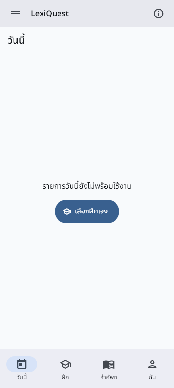
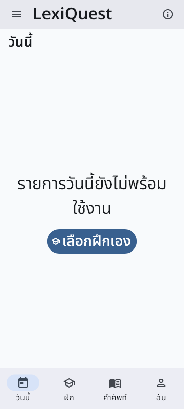

### 2 ฝึก — PASS สำหรับ menu shell; mode content NOT_RUN
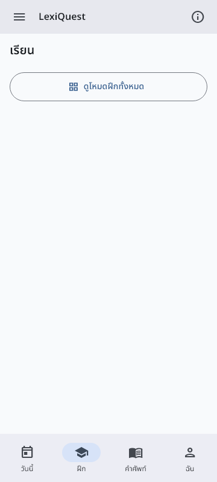
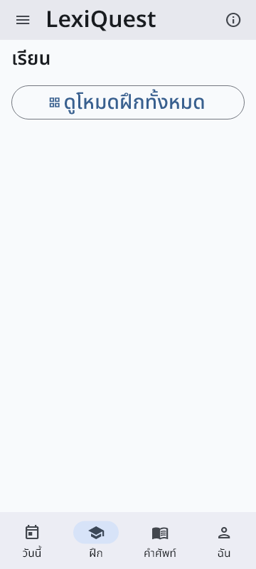

### 3 คำศัพท์ — PASS
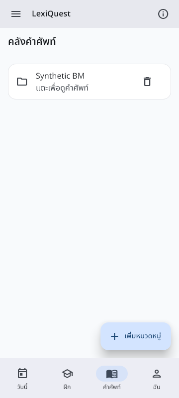
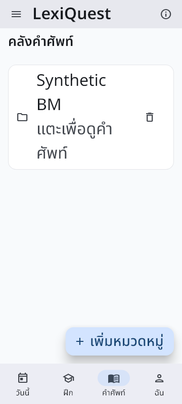

### 4 ฉัน — PASS สำหรับ error/retry; loaded profile NOT_RUN
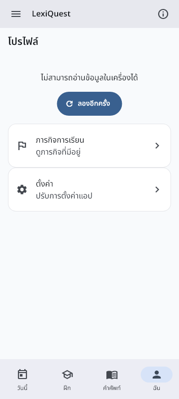
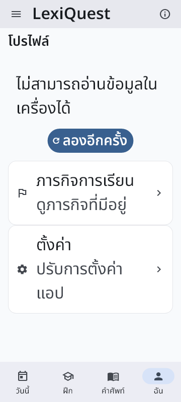

### 5 Settings บน — PASS
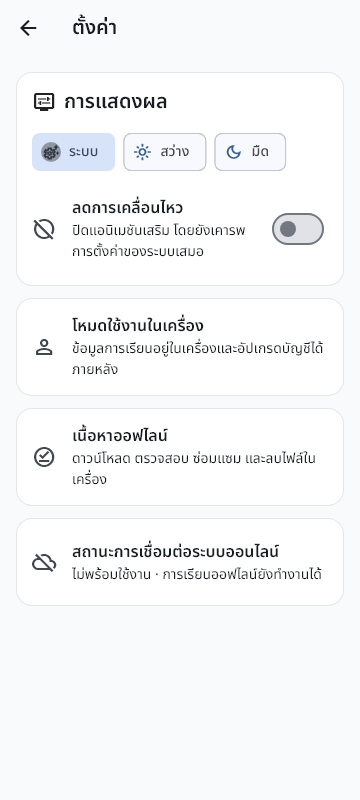
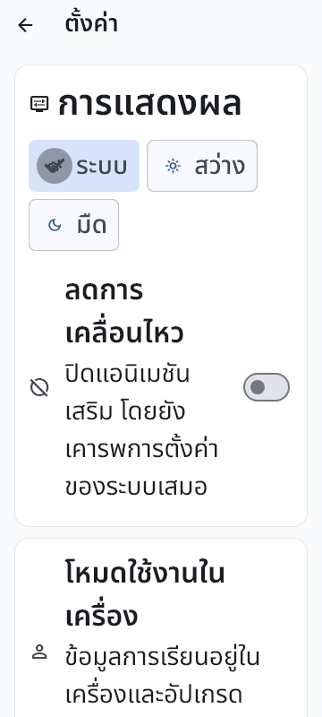

### 6 Settings ล่าง — PASS สำหรับ scroll/guest visibility

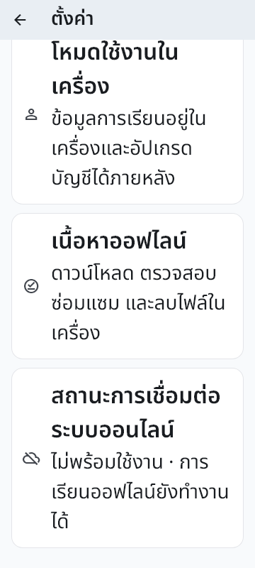

### 7 Offline — PASS สำหรับ entry/back/detail disclosure
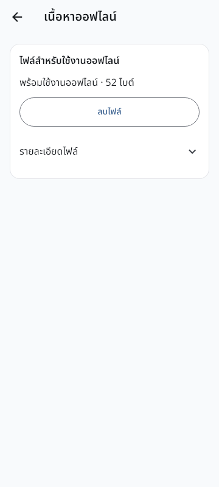
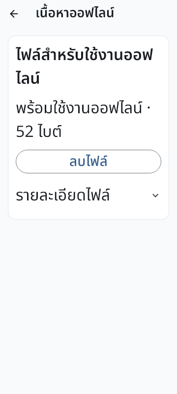
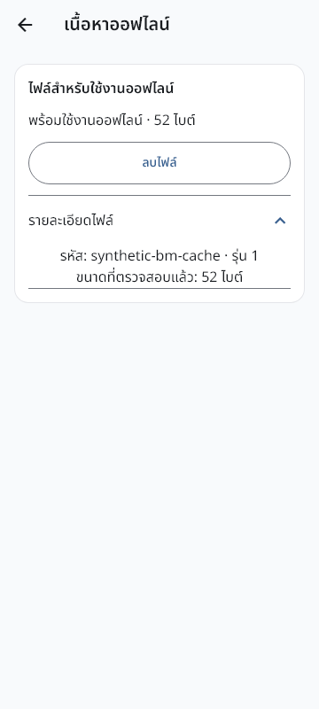
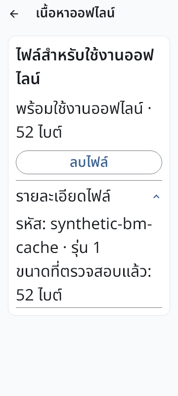

### 8 รายการคำศัพท์ — PASS หลังแก้ search semantics
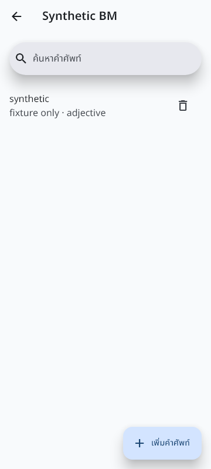
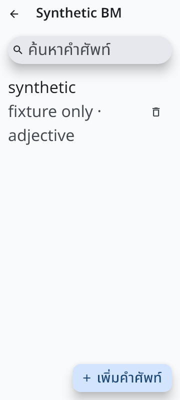

### 9 Search empty — PASS
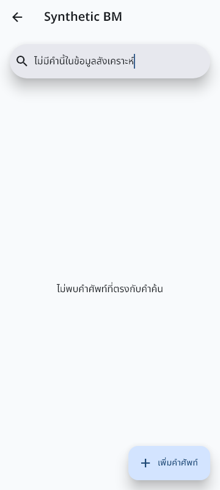
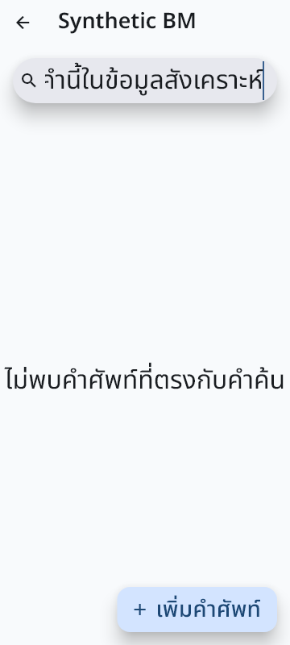

### 10 Category dialog — PASS สำหรับ validation/keyboard cancellation
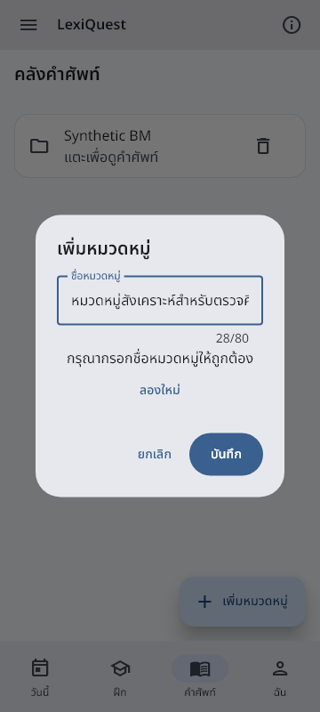
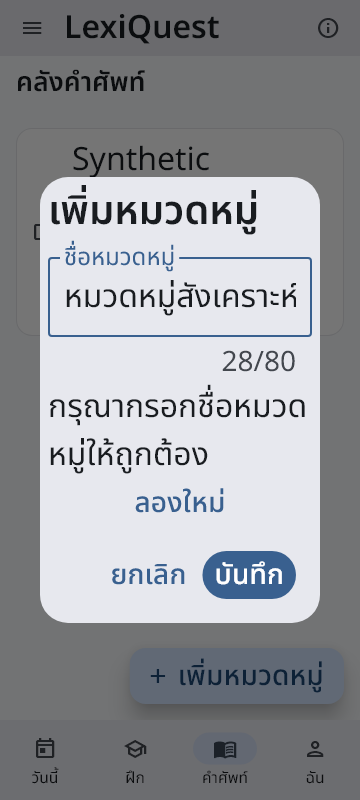

## การแก้ harness และข้อจำกัด

- Capture แรกโหลดเฉพาะฟอนต์ไทยจึงแสดง icon เป็นกล่อง; ปฏิเสธภาพนั้น โหลด MaterialIcons และสร้างใหม่. ย้าย raster encode/write ทั้งชุดเข้า `tester.runAsync` ตาม Flutter golden matcher เพื่อให้ IO จบจริง
- BM snapshot ต้องมี ordinary category+word outbox 2 แถว: BN seed เดิมมีเฉพาะ category จึงเพิ่ม canonical synthetic word ก่อนตรวจ ไม่ผ่อน assertion
- Blank validation ทำให้มีปุ่มลองใหม่ก่อนยกเลิก; ปรับ keyboard assertion ให้ตรวจทั้งสอง focus stops จริง
- Flutter RenderEditable เปิด setText semantics เมื่อ focused เท่านั้น; ตรวจ tap/focus ก่อน setText ไม่เรียกผลก่อน focus ว่า app defect
- เปิดเงาจริงในการ render แทน `debugDisableShadows` ที่ Flutter test เปิดตามค่าเริ่มต้น เพื่อไม่ใช้ขอบดำจาก test อ้างว่าเป็นดีไซน์จริง; คืน flag หลังแต่ละ test
- คืน shadow flag ใน `finally` ก่อน Flutter ตรวจ invariant; `addTearDown` อย่างเดียวช้าเกินไป. Failed gate ถูกเก็บไว้ ไม่ใช้แทน final PASS
- Analyzer ไม่มี error; มี 2 warnings/11 infos ที่บรรทัดเดิมนอก SearchBar diff (ยืนยันจาก Git diff ไม่ได้รัน analyzer บน checkout เก่า); รายละเอียดอยู่ใน validation ไม่อ้าง analyzer clean
- ไม่สร้าง worktree/ZIP/subagent ไม่ใช้ adb UI/VM/browser/Windows UI workaround ไม่แตะ installed packages/real data. ไม่มี Jev/billing/login/probe/inference; current-model deterministic fallback, Standard/default requested, runtime tier unverified, ledger USD5 เดิม

## งานถัดไปที่พร้อมจริง

BM composition ไม่มี `todayHub`, loaded profile dependencies และ lesson registry/controller จึงยังไม่ครอบคลุม baseline ที่ประกอบครบ. งานถัดไปควรเพิ่ม **host-only synthetic composition ของ existing Today/Profile success และ existing learning catalog** จาก production factories/test helpers แล้วตรวจปุ่มที่มีจริง/empty/error/keyboard/layout ก่อนเลือก native delta. ไม่สร้าง lesson ใหม่ ไม่เปิด Phonics/story instructional Flutter ไม่ปิด reviewed-media/qualified-trial gates. อีกส่วนที่ inventory พบแต่ BN ไม่กดคือ quest child และ vocabulary add/edit/delete forms; เลือกเป็น bounded package หลังตรวจ coverage เดิมเพื่อไม่ทำ matrix ซ้ำ

Controller รับ receipt แล้วเลือกงานถัดไป; BN ไม่ dispatch. Sprint S01 ยัง IN_PROGRESS และ user/trial/release acceptance ยังไม่สำเร็จ
