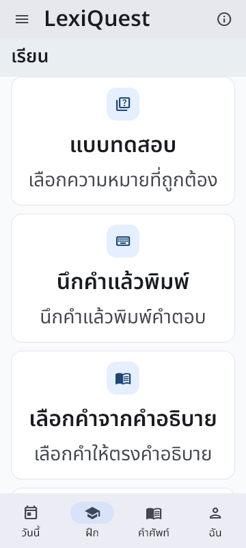
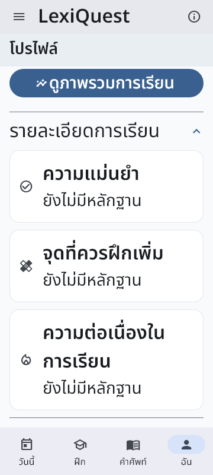

# S01-BO — existing composition host audit

Worktree: `C:/Users/Phet/.codex/worktrees/lexiquest-current/LexiQuest` · branch `codex/ux-current-after-s01-bc` · HEAD `4e70a26b0bf3c44c269bbcbaf9d6d37a273b4dd1`.
Writer: `01a0e0ac-217f-7c42-82f1-1a4248174abd`; controller: `01a0ce9e-23a6-7931-88e6-6390da748f39`.

## ผลและขอบเขต

**HOST SYNTHETIC** ที่ 360×800, DPR1, text scale 1×/2×: เพิ่ม harness สำหรับ Profile ที่โหลดสำเร็จแต่ยังไม่มีประวัติการเรียน, catalog เดิมและแผ่นตั้งค่าก่อนเรียน, และ Today component ที่ใช้ canonical reader บน SQLite สังเคราะห์ ผลผ่าน 4 tests (host 2 + regression เฉพาะจุด 2) ตรวจภาพจริงด้วย `view_image` 18 ไฟล์ โหลด NotoSansThai/MaterialIcons และเปิดเงาจริง ไม่มี production source change และไม่พบ defect ของแอปจากขอบเขตที่ตรวจ

**Today route ยัง NOT_RUN สำหรับ success composition:** `fieldDefaults` ซ่อน `dailyContinuity`; `hasComposedDependencyFor` ยังต้องมี reviewCenter/learningHistory ที่เชื่อมกับ owner/session authority เดียวกัน การเติม `todayHub` อย่างเดียวไม่ทำให้ route พร้อม BO ตรวจว่า gate จริงยังปิดและ fallback ไปแท็บฝึกได้ ส่วน Today success/error/retry ตรวจใน component harness แยก ซึ่งกำหนด prerequisite `dailyContinuity=enabled` เฉพาะ widget test เช่นเดียวกับ test เดิม ไม่มีการเปลี่ยน runtime flags, production registry หรือ composition predicate ผล callback ของ component ไม่ใช่ผล navigation ไป review/history จริง

ไม่มีการเริ่มบทเรียนใหม่, ตอบคำถาม, เปิด Phonics/story ใหม่ หรือปลด gate ด้านเนื้อหา/การทดลอง ไม่ใช้ native UI, adb, browser/VM/helper, provider, login, enrollment, upload, cleanup, installation หรือ deployment ผู้ใช้พัก actual-user participation/trials เป็น **DEFERRED**; BM native เป็นประวัติของ snapshot BM เท่านั้น

## Inventory ที่ตรวจ source/test ก่อนลงมือ

- Reuse `baselineDependencies`, `NativeBaselineFixture`, `baselineAwait`; เพิ่มเฉพาะ `test/support/composed_host_ui_audit_test.dart` ไม่แก้ fixture ของ BM/BN
- ใช้ `TodayHubUseCases` → `DriftTodayHubReader`, `DriftReviewCenterReader`, `RecommendationUseCases`/`DriftRecommendationReader`, owner identity reader จริง
- Profile ใช้ `ProgressUseCases`/`DriftProgressQueries` และ default `DriftPersonalLearningProfileReader`; ไม่มี fabricated learning projection
- Learning ใช้ `buildLessonModeRegistry()` และ `UnifiedLessonController` ที่อ้าง learning authority เดิม; matching/handwriting ที่ implemented-off ยังไม่ถูกเปิด
- อ่าน coverage เดิมของ Today, Profile, ChooseMode และ MainNavigation ก่อนเลือกการตรวจ; ไม่รัน offline matrix ซ้ำ

| Surface / action | ผล BO | ขอบเขตหลักฐาน |
| --- | --- | --- |
| Main Today gate + fallback | PASS | flag hidden และ composition ไม่ครบยังปิด; เลือกฝึกเองเปลี่ยน selected tab เป็น 1 |
| Learning starter/catalog | PASS | แสดง starter, เปิด catalog, ไม่แสดง matching ที่ implemented-off; ภาพไทย 1×/2× |
| Quiz catalog → configuration | PASS | เปิด sheet จริงโดยไม่เริ่ม session; Tab หา close และ Enter ปิด กลับหน้าฝึก |
| Profile success/no evidence | PASS | โหลด owner ในเครื่อง, ไม่แสดง error, บอกว่ายังไม่มีหลักฐานแทนศูนย์ความสามารถ |
| Profile details/overview/back | PASS | ขยาย/ยุบรายละเอียด, เข้า overview, กด BackButton จริงแล้วอ่าน owner ได้ |
| Today isolated component | PASS | canonical empty read, synthetic failure ครั้งแรก → retry → success; practice/review/history delegates ถูกเรียกอย่างละครั้ง |
| Tap semantics / layout | PASS | `androidTapTargetGuideline` ทุก capture; ไม่มี Flutter layout exception; real fonts/icons/shadows |
| Synthetic data/network invariant | PASS | snapshot ก่อน/หลังเท่ากัน; research/learning/reward rows เป็น 0 ตาม fixture; ordinary category+word outbox 2 ไม่เปลี่ยน; HTTP calls 0 |
| Fully routed Today success/resume/history/review | NOT_RUN | parent gates ยังปิด; ไม่มีการอ้าง component callback เป็น routed success |
| Profile ที่มี learning evidence, ทุกโหมด/ทุกตัวเลือก | NOT_RUN | BO ตรวจ loaded-empty และ selected quiz entry เท่านั้น |
| Native visual/TalkBack/IME, user trials, full release | NOT_RUN / DEFERRED | ไม่ใช่ device screenshot, screen-reader result หรือ usability evidence |

## Verification และ recovery ที่เก็บไว้

Final `verify-scope Targeted/Runtime` 3 selections บน fingerprint เดียวกันก่อน/หลัง:
`2baa24f77784fd061ae4d9e0b10179a1fb0b94da314ed8be29b87b194031e859`.

- `verify-accepted.log`: new host composition 2 tests PASS
- `verify-keyboard.log`: existing `A-UI-03 Today keyboard follows primary then manual practice` 1 PASS
- `verify-profile.log`: existing `empty profile says no evidence instead of zero proficiency` 1 PASS
- `analysis-final.log`: `dart analyze test/support/composed_host_ui_audit_test.dart` — no issues. ไม่ได้รัน repository-wide analyzer; warning/info เดิมของ BN ไม่ได้ถูกปิดด้วยผลนี้
- Focused final review และ `git -c core.whitespace=cr-at-eol diff --check` PASS; ไม่ normalize CRLF ของงานเก่า

เก็บ failed runs ไว้ใน `evidence/S01-BO-runs/`: (1) enum ใน harness ใช้ชื่อผิด แก้เป็น `missing` ตาม production factory; (2) คาดว่า todayHub อย่างเดียวเปิด route ได้ ทั้งที่ feature/composition gate ปิด แยก component audit และคง routed success เป็น NOT_RUN; (3) `pageBack()` หา tooltip ภาษาอังกฤษไม่พบ ใช้ BackButton จริงตาม BN; (4) disabled Today prerequisite ทำให้ callback ไม่ถูกเรียก แยก enabled prerequisite เฉพาะ component test โดยไม่แตะ app registry; (5) ขาดวงเล็บปิด class ใน harness; (6) ใช้ `Focus.of` กับ context ของ IconButton ซึ่ง focus อยู่ข้างใน เปลี่ยนเป็นตรวจ ancestor ของ primaryFocus ตาม test เดิม; (7) test selector ใช้ regex แต่ verifier ส่ง `--plain-name` จึงไม่พบ test แก้เป็น selections ชื่อตรงแยกกัน ไม่ลด assertion หรืออ้างรอบเหล่านี้ว่า PASS. Analyzer info เรื่อง braces แก้แล้วก่อน final gates

## ภาพที่ตรวจ

ทุกไฟล์ใน [host-renders](evidence/S01-BO-runs/host-renders/) เป็น **HOST SYNTHETIC**. แต่ละชื่อมี `1.0x` และ `2.0x`:

| Prefix | สิ่งที่เห็น |
| --- | --- |
| 01-today-component-loaded | loaded-empty; ไทย 2× ตัดบรรทัดแต่ไม่มี overflow |
| 02-learn-starter | starter และเปิด catalog อ่านได้ |
| 03-learn-catalog | 1× สองคอลัมน์; 2× คอลัมน์เดียว; เป็น viewport ไม่ใช่ทุก tile |
| 04-mode-entry | sheet ตั้งค่าก่อนเรียน ปุ่ม close/start/options อยู่ใน viewport |
| 05-profile-loaded | owner card; 2× ต้องเลื่อนเพื่ออ่านส่วนล่าง |
| 06-profile-details | ส่วนรายละเอียดและ no-evidence อ่านได้หลังเลื่อน |
| 07-profile-overview | overview-empty; 2× เป็น viewport ส่วนบน ต้องเลื่อนต่อ |
| 08-today-component-lower | หลัง reveal history; empty content สั้น จึงใกล้เคียงภาพ 01 ไม่ใช่ coverage ใหม่ |
| 09-today-component-error | ข้อความ error/retry อ่านได้ 1×/2× |

## Handoff

Hashes, exact source closure, render pins, failure logs และ preservation อยู่ใน [validation](evidence/S01-BO-validation.json) และ [checkpoint](evidence/S01-BO-checkpoint.json). รักษา dirty BD–BN/generated7 ทั้งหมด ยกเว้นการอัปเดต README/state ตามงานนี้ ไม่มี test/build process ค้างจาก BO

งานพร้อมถัดไปที่พบจริง: host route ของ **quest child และ vocabulary add/edit forms** ที่ BN/BO ยังไม่กด; เริ่มจาก `quest_status_screen_test.dart`, `word_form_recovery_test.dart`, `vocab_list_screen_test.dart` เพราะมี owner/recovery coverage อยู่แล้ว เลือกเฉพาะช่องว่าง visual/keyboard/navigation บนข้อมูลสังเคราะห์ ไม่ทำ lifecycle matrix ซ้ำ ไม่ลบข้อมูลจริง ไม่ dispatch จาก BO

Current-model deterministic fallback; Standard/default requested, runtime tier unverified; ไม่มี Jev/billing probe/login/inference หรือการแก้ ledger USD5. Writer RELEASED หลัง checkpoint; controller เลือกงานถัดไป S01 ยัง IN_PROGRESS, UX-D01–25 OPEN; ไม่มี full-baseline/native/user/trial/release acceptance
