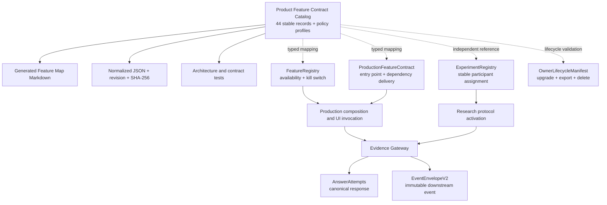

# LexiQuest AllTCAS Idea Integration — Machine-Verifiable Feature Contract Design

**Status:** APPROVED DIRECTION — CONTRACT DETAIL FOR OWNER REVIEW

**Date:** 2026-08-14

**Authoritative baseline:** `feature/alltcas-8-44-integration` @ `61a4fec`

**Scope:** 8 domains, 44 product/research capabilities, 2 experimental candidates, and Layer 0 Compatibility & Safety Backbone

## 1. Decision

LexiQuest will use **Approach B: Machine-verifiable Feature Contract** as the
central authority for the approved AllTCAS Idea Integration scope.

The contract will:

1. preserve the agreed **8 domains / 44 capabilities** without expanding the
   product scope;
2. describe ownership, dependencies, evidence effects, research role, data
   lifecycle, rollout, rollback, and verification in one typed catalog;
3. generate the human-readable Feature Map and a normalized JSON snapshot;
4. fail the build or product-completion gate when code, data lifecycle, runtime
   activation, generated documentation, or research policy drifts from the
   catalog; and
5. remain separate from runtime activation and experiment assignment so that a
   documentation change cannot silently enable a feature or move a research
   participant between groups.

The catalog is a **product and research contract**, not a third feature-flag
registry and not a new production data store.

### 1.1 สรุปสำหรับเจ้าของโครงการ

- ล็อกขอบเขตหลักไว้ที่ 8 หัวข้อ 44 ความสามารถตามที่อนุมัติแล้ว
- เพิ่ม Layer 0 จำนวน 12 controls เป็นเงื่อนไขความเข้ากันได้และความถูกต้องของ
  ข้อมูลงานวิจัย โดยไม่ถือเป็นหัวข้อที่ 9 หรือฟีเจอร์ที่ 45
- ใช้ typed Dart catalog เป็นทะเบียนที่แก้ไขได้เพียงจุดเดียว แล้วสร้าง Feature
  Map และ JSON อัตโนมัติ
- ไม่รวมทะเบียน 44 ข้อเข้ากับ Runtime Feature Registry เพราะทั้งสองมีหน้าที่
  ต่างกัน และไม่ให้การเพิ่มข้อมูลในทะเบียนเปิดฟีเจอร์จริงโดยอัตโนมัติ
- เริ่มระยะแรกด้วย catalog, generator และ contract tests เท่านั้น จึงยังไม่
  เปลี่ยน UI, schema, APK, participant assignment หรือพฤติกรรม production

## 2. Goals and Non-Goals

### 2.1 Goals

- Give every capability a stable ID and one primary completion contract.
- Prevent duplicate models, duplicate writers, duplicate projections, and
  incompatible side effects.
- Preserve research validity by separating Outcome, Learning, Effort, and
  Engagement.
- Make all 44 capabilities traceable to current implementation coverage:
  Existing, Partial, or New.
- Make documentation reproducible from executable metadata rather than manual
  copy-and-paste.
- Support staged delivery without changing the active release candidate or
  research cohort unexpectedly.
- Make lifecycle completeness testable for migration, guest upgrade, sync,
  export, withdrawal, deletion, retention, and offline cleanup.

### 2.2 Non-Goals

This design does not authorize or introduce:

- TCAS or university admission-score calculation;
- university, faculty, admission-rule, or application databases;
- a generic calculator;
- online rooms, realtime multiplayer, friend graph, chat, or direct messages;
- subscriptions, payment, paywalls, or entitlement-gated learning;
- OCR handwriting recognition;
- a public global leaderboard;
- a second Vocabulary, SRS, Mastery, Quest, Streak, XP, Coin, Reward, or
  Learning Evidence authority;
- a big-bang rewrite of the current local-first application; or
- activation of all 44 capabilities in one research intervention.

The two experimental candidates remain outside the 44-capability catalog:

- `EXP-P1`: Local Same-Device Party Game
- `EXP-P2`: Private Effort Comparison

They may be represented in a separate generated appendix, but contract tests
must ensure they are never counted in the main catalog and never enabled by a
main-catalog rollout state.

## 3. Verified Baseline and Constraints

The implementation design must start from the clean, newer worktree
`feature/alltcas-8-44-integration` @ `61a4fec`, not the older root checkout at
`f43aa0f`.

Verified baseline authorities include:

| Concern | Current authority | Constraint for this design |
|---|---|---|
| Runtime availability and kill switch | `lib/runtime/registries/feature_registry.dart` | Keep as the only runtime activation authority. Do not expand its meaning to all 44 product contracts. |
| Production entry and dependency delivery | `lib/runtime/production_feature_contract.dart` | Keep as the runtime delivery adapter. It maps runtime capabilities to entry points and composed dependencies. |
| Experiment assignment | `ExperimentRegistry` | Must stay independent from feature visibility and runtime kill switches. Current no-op behavior is not sufficient for a research pilot. |
| Consent | Drift consent use cases plus `ConsentRegistry` | Must converge before research activation; unknown/no-op consent must fail closed. |
| Canonical scored response | `answer_attempts` | Extend the existing attempt contract; never create a third answer/evidence log. |
| Immutable downstream event | `events_v2` / `EventEnvelopeV2` | Correlate to the same source evidence ID and use for reconciliation/projections; do not compete with `answer_attempts` as a second score truth. |
| Vocabulary | Production Vocabulary domain and IDs | Learning Packs reference canonical Vocabulary IDs and revisions. They do not own duplicate word rows. |
| Data lifecycle | `ownerLifecycleManifest` | All current Drift tables are classified. Any new table must enter the same manifest and exact-set lifecycle tests. |
| Local database | Drift schema v12 | No schema change is required merely to introduce the catalog. Later feature data follows forward-only migrations. |
| Product verification | `tool/cli/verify-product-completion.ps1` | The deterministic contract check joins this gate only after the catalog, generator, and focused tests are stable. |

Additional constraints discovered in the current system:

- Runtime flags are persisted using `Feature.name`; existing enum values cannot
  be renamed without a migration.
- `recordAnswer()` currently reaches multiple projections and motivational side
  effects without an evidence-eligibility classification.
- XP and spendable currency still share ledger behavior that can make lifetime
  progress decrease after a purchase.
- Streak is represented by both a dedicated authority and recomputation from
  attempt dates.
- Existing activity type, prompt mode, event type, and some dependency IDs are
  strings; the contract must expose and gradually replace unsafe string joins,
  not bless them as permanent authorities.
- `EventEnvelopeV2` is frozen. Research-specific metadata must use a versioned
  evidence context or a new envelope version; it must not silently add fields to
  V2 without a schema-version decision.

## 4. Authority Model



### 4.1 Authority Precedence

1. Domain authorities own behavior and persisted state.
2. `FeatureRegistry` owns runtime availability and emergency shut-off.
3. `ProductionFeatureContract` owns the route/dependency delivery mapping for
   runtime capabilities.
4. `ExperimentRegistry` owns research assignment and never derives assignment
   from feature visibility.
5. The Product Feature Contract owns scope, traceability, allowed integration,
   and verification metadata.
6. Generated Markdown and JSON are derivative artifacts and may not be edited
   manually.

Adding a record to the Product Feature Contract must not activate a screen,
compose a dependency, run a migration, or assign a participant. Those are
separate, testable transitions.

## 5. Canonical Contract Artifacts

The implementation plan should create this bounded structure:

```text
lib/product/feature_contract/
  feature_contract_models.dart
  compatibility_profiles.dart
  alltcas_idea_integration_catalog.dart

tool/feature_contract/
  generate_feature_map.dart

test/architecture/
  alltcas_idea_feature_contract_test.dart
  alltcas_idea_feature_contract_docs_test.dart

docs/generated/
  alltcas-idea-integration-feature-map.md
  alltcas-idea-integration-feature-map.json
```

The Dart `const` catalog is the only author-edited source. This follows the
existing typed-manifest pattern used by owner lifecycle and avoids adding YAML,
a parser dependency, or a second hand-maintained registry.

The `lib/product/feature_contract/` package contains immutable metadata only.
Production screens and services must not call it to decide whether a feature is
enabled. Dart tree shaking can remove it from application builds when it is used
only by generation and verification tooling.

### 5.1 Stable Identifiers

- Main IDs: `f01` through `f44`
- Completion contracts: `c1` through `c8`
- Experimental IDs: `expP1` and `expP2`, in a separate collection
- IDs are never renamed or reused.
- A removed capability becomes `retired`; its ID remains reserved.
- Display names and Thai descriptions may change without changing identity.
- The canonical source list is stored in numeric ID order. Generated views may
  group `f40`, `f41`, and `f44` under Domain 7 before rendering `f42` and `f43`
  under Domain 8; this presentation order does not change identity or sequence.

### 5.2 Feature Contract Descriptor

Every main-catalog record must include:

| Field | Meaning |
|---|---|
| `id` | Stable `f01`–`f44` identity |
| `ordinal` | Human sequence number 1–44 |
| `domain` | One of the eight approved domains |
| `name` / `purpose` | Human-readable capability and responsibility |
| `provenance` | AllTCAS-confirmed, adapted-to-LexiQuest, or LexiQuest-enabling control |
| `coverage` | Existing, Partial, or New against the baseline commit |
| `completionContract` | Exactly one of C1–C8 |
| `authorityProfile` | Canonical writer and read authorities |
| `runtimeCapabilities` | Zero or more typed mappings to existing `Feature` values |
| `productionEntries` | Zero or more stable production entry IDs |
| `dependencies` | Typed references to other feature IDs and domain authorities |
| `researchRole` | Neutral, Infrastructure, Intervention, Measurement, or Engagement |
| `evidenceProfile` | Evidence produced and allowed/forbidden projections |
| `lifecycleProfile` | Local, sync, export, withdrawal, deletion, retention, and cleanup behavior |
| `activationProfile` | Always-on foundation, runtime-flagged, protocol-assigned, or read-model-only |
| `rolloutProfile` | Minimum rollout ring and promotion gates |
| `rollbackProfile` | Invocation, data, projection, and content rollback behavior |
| `verificationRefs` | Stable test/gate identifiers rather than prose-only promises |
| `contractRevisionIntroduced` | Revision in which the semantic contract first appeared |

Repeated policy is referenced through typed profiles rather than copied into 44
independent blocks. Tests resolve every profile and fail when a reference is
missing.

### 5.3 Contract Version and Hash

The catalog has a semantic `contractRevision` and a deterministic SHA-256 hash.

- Patch revision: wording, references, or generated presentation only.
- Minor revision: additive non-breaking metadata or a newly supported rollout
  state that does not change evidence semantics.
- Major revision: authority, allowed projection, evidence classification,
  research role, lifecycle behavior, feature identity, or completion semantics.

The generator canonicalizes record order, set order, line endings, and JSON key
order before hashing. The generated Markdown and JSON include the revision,
baseline commit, generator version, and hash.

Research exports and study protocol snapshots must record the contract revision
and hash. Learning evidence records use a versioned evidence context so that the
contract version can be reconstructed without mutating the frozen V2 envelope
silently.

## 6. Approved 8/44 Catalog

Legend:

- `A`: confirmed or directly adapted from the reference product
- `A→L`: reference-product mechanic adapted to LexiQuest's learning/research use
- `L`: LexiQuest-specific integration or safety capability
- Coverage is measured against `feature/alltcas-8-44-integration` @ `61a4fec`

### Domain 1 — Learning Content & Packs / C1

| ID | Capability | Source | Coverage | Responsibility |
|---|---|---:|---|---|
| f01 | Curriculum & Learning Pack Catalog | A | Partial | Discover and filter versioned packs by CEFR, topic, skill, and goal while referencing canonical Vocabulary IDs. |
| f02 | Learning Pack Detail | A | Partial | Explain pack level, content, progress, examples, and available activities before a session starts. |
| f03 | Rich Lexical Card | A | Partial | Present canonical meanings, part of speech, CEFR, IPA, audio, examples, synonyms, and antonyms progressively. |
| f04 | Content Version & Quality Control | L | Partial | Pin revision, provenance, review state, checksum, and publication status for reproducible learning and research. |

### Domain 2 — Unified Learning Experience & Activity Modes / C2

| ID | Capability | Source | Coverage | Responsibility |
|---|---|---:|---|---|
| f05 | Unified Lesson Shell | L | New | Own shared session state, progress, pause/resume, timer, audio actions, completion, and adapter boundaries. |
| f06 | Flashcard Mode | A | Existing | Support exposure and self-rated recall through the existing SRS authority. |
| f07 | Meaning Quiz | A | Existing | Measure bidirectional meaning recognition without inventing a second quiz authority. |
| f08 | Definition Quiz | A | Partial | Practice English-definition recognition with explicit evidence calibration. |
| f09 | Cloze Test | A | Partial | Practice contextual retrieval; selected and typed variants receive different evidence profiles. |
| f10 | Matching Mode | A | New | Train fluent recognition with lower mastery weight than independent recall. |
| f11 | Typed Recall / Writing | A | Partial | Capture independent spelling and productive recall from meaning, audio, or context. |
| f12 | Handwriting Scratchpad | A | New | Provide local, ephemeral handwriting and self-checking without OCR or automatic mastery claims. |
| f13 | LexiQuest Native Modes Integration | L | Partial | Adapt Dictation, Speaking, Shadowing, Reading, Scramble, and Associative Reading to the shared shell and evidence gateway. |

### Domain 3 — Recall, Feedback & Learner Control / C3

| ID | Capability | Source | Coverage | Responsibility |
|---|---|---:|---|---|
| f14 | Flashcard-First Recommendation | A | Partial | Recommend preparation before harder recall while preserving learner choice. |
| f15 | Active-Recall Ladder | L | Partial | Sequence exposure, recognition, matching, cloze, typed recall, dictation, and speaking from evidence. |
| f16 | Session Configuration | A | Partial | Configure item count, direction, difficulty, hints, time, and pack within protocol limits. |
| f17 | Immediate Answer Feedback | A | Existing | Show accessible correct/incorrect feedback without creating an additional scored event. |
| f18 | Contrastive Distractor Explanation | A | New | Explain the correct answer and the learner's selected distractor as guided feedback. |
| f19 | Hint, Strategy & Context | A | Partial | Record hint level and provide staged support without counting assisted work as independent recall. |
| f20 | Bookmark / Save | A | New | Preserve learner intent to revisit an item without classifying it as weakness. |
| f21 | Flag / Report Content | A | New | Submit versioned quality reports for ambiguous or incorrect text, audio, answer, or explanation. |

### Domain 4 — Review, Time & Research Assessment / C4

| ID | Capability | Source | Coverage | Responsibility |
|---|---|---:|---|---|
| f22 | Review Center | A→L | Partial | Compose saved, incorrect, due-SRS, and reported items while preserving the reason for each queue entry. |
| f23 | Focus Timer | A | New | Create explicit focus intervals with start, pause, resume, and finish states. |
| f24 | Automatic Learning-Time Capture | A→L | Partial | Measure active effort while excluding idle and background time from learning duration. |
| f25 | Learning Calendar & Weekly Analytics | A | Partial | Present effort, accuracy, skill distribution, and trends as separate measures. |
| f26 | Goal / Test Countdown | A→L | New | Track language-test, course, or personal learning deadlines without admission-score logic. |
| f27 | Opt-in Study Reminder | A→L | New | Schedule user-controlled reminders for due review or goals without punitive messaging. |
| f28 | Learning Assessment & Progress Comparison | L | New | Run versioned pre-learning and post-learning assessment and report their comparison separately from practice. |

### Domain 5 — Motivation & Engagement / C5

| ID | Capability | Source | Coverage | Responsibility |
|---|---|---:|---|---|
| f29 | Evidence-Based Quest | A→L | Existing | Advance the existing Quest authority only from evidence allowed by the active policy. |
| f30 | Gentle Streak | A→L | Existing | Use the dedicated Streak authority with grace, freeze, and recovery rules that avoid punishment. |
| f31 | Achievement & Milestone | A | Existing | Unlock durable milestones from eligible, idempotent learning evidence. |
| f32 | Avatar Level-Up & Cosmetic Unlock | A | Partial | Connect lifetime progression to cosmetics while keeping XP and spendable Coins separate. |
| f33 | Contextual Companion | A | Partial | Use scripted, versioned reactions to session events before considering generative behavior. |
| f34 | Achievement Share Card | A | New | Generate an opt-in shareable artifact without creating an internal social network. |

### Domain 6 — Personalization, Preferences & Accessibility / C6

| ID | Capability | Source | Coverage | Responsibility |
|---|---|---:|---|---|
| f35 | Learning Preference & Goal Quiz | A→L | New | Set editable defaults from goals, available time, and activity preference without fixed learning-style labels. |
| f36 | Personal Learning Profile | A | Partial | Read separate Mastery, SRS, effort, accuracy, weakness, and engagement projections. |
| f37 | Recommendation Panel | L | Partial | Explain the next suggested activity from canonical projections while allowing learner override. |
| f38 | Accessibility | L | Partial | Enforce scaling, screen-reader semantics, non-color cues, untimed alternatives, and input/media alternatives. |
| f39 | Motion & Theme Controls | A→L | Partial | Support Light, Dark, System, and Reduced Motion consistently. |

### Domain 7 — Local Reliability, Offline & Rollout / C7

| ID | Capability | Source | Coverage | Responsibility |
|---|---|---:|---|---|
| f40 | Local-First Operation | L | Existing | Commit locally before cloud synchronization and preserve learning through outages and restarts. |
| f41 | Feature Flag & Controlled Rollout | L | Existing | Use the existing runtime registry for Internal → Pilot → Enabled rollout, kill switch, and fail-closed invocation. |
| f44 | Offline Content Manager | L | Partial | Download, verify, pin, repair, and remove content/media versions without deleting learning evidence. |

### Domain 8 — Daily Continuity & History / C8

| ID | Capability | Source | Coverage | Responsibility |
|---|---|---:|---|---|
| f42 | Today Hub | L | New | Compose assigned, due, resumable, and recommended work from canonical read models; it owns no progress metric. |
| f43 | Learning History | L | Partial | Present immutable session/evidence history; replay creates a new session and never edits the original evidence. |

### 6.1 Coverage Invariant

Contract tests must enforce the approved baseline distribution:

- Existing: 8 — `f06`, `f07`, `f17`, `f29`, `f30`, `f31`, `f40`, `f41`
- Partial: 23 — `f01–f04`, `f08`, `f09`, `f11`, `f13–f16`, `f19`,
  `f22`, `f24`, `f25`, `f32`, `f33`, `f36–f39`, `f43`, `f44`
- New: 13 — `f05`, `f10`, `f12`, `f18`, `f20`, `f21`, `f23`,
  `f26–f28`, `f34`, `f35`, `f42`

Coverage is an audited baseline classification, not a rollout state. A feature
may be Existing while disabled, or New while fully contracted but not yet
implemented.

## 7. Layer 0 — Compatibility & Safety Backbone

Layer 0 is not a ninth product domain and is not feature 45. It contains twelve
mandatory controls shared by the 44 contracts.

| Control | Required outcome | Earliest gate |
|---|---|---|
| L0-01 Central Contract Catalog | Exactly 44 typed, resolvable records and two separately classified experimental candidates | Before implementation planning |
| L0-02 Single-Writer Authority Matrix | One canonical writer for Vocabulary, Evidence, Mastery/SRS, Assessment, Streak, XP, Coins, Quest, History, and Download State | Before feature integration |
| L0-03 Evidence Eligibility Matrix | Every evidence class has an explicit allow/deny decision for every projection family | Before new activity modes |
| L0-04 Research Version Envelope | Build, schema, content, policy, protocol, assignment, instrument/form, and contract versions are reconstructible | Before pilot data collection |
| L0-05 Session State & Idempotency | Planned/active/paused/completed/abandoned transitions and one reusable evidence ID per response | Before Unified Lesson Shell |
| L0-06 Known-Conflict Gate | XP/Coins split, Streak authority selected, mode mappings complete, and focused/full tests green | Before activating 8/44 |
| L0-07 Projection Version & Shadow Compare | New projections are replayable and compared against the baseline before cutover | Before authority migration |
| L0-08 Migration & Lifecycle Gate | New owner data is covered by schema, upgrade, sync, export, withdrawal, delete, retention, and cleanup | Before merging a new table |
| L0-09 Time Authority Policy | UTC occurrence time, timezone context, and monotonic duration have separate semantics | Before timer/streak research |
| L0-10 Consent, Withdrawal & Retention | Consent snapshot is real, withdrawal is honored, and retention is protocol-defined | Before research activation |
| L0-11 Content QA & Provenance | Every study pack and assessment form is reviewed, version-pinned, sourced, and checksummed | Before participant delivery |
| L0-12 Research Data-Quality Monitor | Duplicate evidence, arm drift, version drift, negative time, forbidden side effects, and missing exports are detectable | Before pilot promotion |

## 8. Evidence and Projection Contract

### 8.1 Canonical Flow

```text
Activity Adapter
  -> Evidence Gateway
  -> validate Session + Evidence Context + Consent + Assignment
  -> persist one AnswerAttempt / activity evidence with one evidence ID
  -> append one correlated immutable EventEnvelope
  -> Eligibility Policy
  -> approved projections only
```

The same `evidenceId` or deterministic source-event identity must be reused by
the attempt, immutable event, outbox, Quest receipt, reward receipt, and
projection reconciliation. Retries with identical content are idempotent;
retries with the same ID and different content fail.

### 8.2 Evidence Classes

| Evidence class | Mastery/SRS | Assessment | Effort/History | Quest/XP/Coins |
|---|---:|---:|---:|---:|
| `assessment` | Deny | Allow | Allow | Deny |
| `independentRecall` | Allow | Deny | Allow | Protocol-controlled |
| `recognition` | Calibrated policy only | Deny | Allow | Protocol-controlled |
| `guidedPractice` | Deny | Deny | Allow | Deny by default |
| `pronunciation` | Pronunciation projection only | Deny | Allow | Deny by default |
| `exposure` | Deny | Deny | Allow | Deny |
| `recreational` | Deny | Deny | Game history only | Deny by default |

An activity may support multiple evidence classes only when the adapter chooses
one deterministically from input method, hint usage, assessment phase, and
policy version. The activity screen never writes a projection directly.

### 8.3 Research Separation

The contract preserves four independent axes:

- **Outcome:** pre/post assessment results
- **Learning:** Mastery, SRS, and skill projections
- **Effort:** active learning time and session completion
- **Engagement:** Quest, Streak, XP, Coins, Avatar, and achievements

No combined score is allowed to replace these axes in research export or
analysis. Assessment cannot grant learning or motivational rewards, and
engagement cannot raise assessment or mastery outcomes.

## 9. Completion Contracts C1–C8

| Contract | Feature count | Completion condition | Forbidden failure |
|---|---:|---|---|
| C1 Content & Pack | 4 | Canonical Vocabulary references, revision, provenance, QA state, and checksum are reproducible | Duplicate CEFR/word catalog or unpinned study content |
| C2 Session & Activity | 9 | Every mode uses the Unified Shell, declared state machine, typed adapter, and idempotent session/evidence identity | Screen-specific DB writes or duplicate completion |
| C3 Evidence & Feedback | 8 | Every answer/support action records class, skill, hint level, and policy before side effects | Assisted or recreational work counted as independent retention |
| C4 Research Assessment | 7 | Stable assignment, consent snapshot, form/instrument version, assessment isolation, and trustworthy time exist | Pre-test teaches content, exposes answers, or grants rewards |
| C5 Motivation & Economy | 6 | Eligible evidence only, single Quest/Streak authority, lifetime XP separated from Coins, idempotent grants | Purchases reduce level or every activity advances motivation |
| C6 Personalization & Accessibility | 5 | Preferences are editable, recommendations explainable, protocol-safe, and every mode has accessible alternatives | Preference silently changes research arm or blocks a participant's input mode |
| C7 Offline, Lifecycle & Rollout | 3 | Local-first persistence, complete owner lifecycle, verified downloads, fail-closed flags, and rollback tests pass | New data cannot migrate/export/delete/sync or corrupted content changes evidence |
| C8 Today Hub & History | 2 | Hub and History are read models over canonical authorities; replay is a new immutable session | A new Hub/History progress authority or retrospective evidence edits |

Count invariants:

- C1 = 4
- C2 = 9
- C3 = 8
- C4 = 7
- C5 = 6
- C6 = 5
- C7 = 3
- C8 = 2
- Total = 44

Every contract must pass five evidence families before a capability is promoted:

1. domain and unit tests;
2. migration and projection-rebuild tests when persisted data changes;
3. guest-upgrade, sync, export, withdrawal, deletion, and retention coverage;
4. offline/restart integration journey; and
5. feature-off, emergency-off, and forward-only rollback verification.

## 10. Generated Outputs

The generator exposes two deterministic modes:

```powershell
dart run tool/feature_contract/generate_feature_map.dart --write
dart run tool/feature_contract/generate_feature_map.dart --check
```

`--write` regenerates Markdown and JSON. `--check` performs no writes and exits
non-zero when output differs byte-for-byte from the canonical catalog.

The generated Markdown contains:

- revision, hash, and baseline;
- the central 8-domain map;
- all 44 records and coverage status;
- runtime capability and production-entry mappings;
- C1–C8 traceability;
- evidence and lifecycle profiles;
- dependency and rollout summaries; and
- the separately labeled experimental appendix.

The normalized JSON supports automated review, research export provenance, and
future dashboards. It is generated output, not a runtime remote configuration
format.

## 11. Mandatory Contract Tests

### 11.1 Catalog Integrity

- IDs are exactly `f01`–`f44`, unique, ordered, and non-reusable.
- There are exactly eight domains with the approved counts.
- Every record resolves exactly one C1–C8 contract.
- Existing/Partial/New totals are exactly 8/23/13 for the baseline revision.
- Experimental candidates are disjoint from the main catalog.
- Dependencies resolve to real IDs and the dependency graph is acyclic.
- Every referenced profile and verification ID exists.

### 11.2 Runtime Compatibility

- Runtime mappings use typed `Feature` values, never duplicated strings.
- Adding a product contract does not make a runtime feature visible or enabled.
- Every `enabled` or `limited` runtime feature has a valid
  `ProductionFeatureContract`, composed dependency, entry point, and rollback.
- Persisted runtime enum names remain stable or have an explicit migration.
- Feature visibility never implies experiment assignment.
- No main-catalog capability depends on payment or entitlement.

### 11.3 Evidence and Research Integrity

- Every production activity/prompt mode resolves an evidence class.
- Every evidence-class/projection pair has an explicit Allow, Deny, or
  versioned Calibrated decision.
- Assessment fails if it can update SRS, Mastery, Quest, Streak, XP, Coins, or
  achievements.
- One response reuses one source evidence identity across persistence,
  downstream event, outbox, and projections.
- Research evidence has real consent, stable assignment, contract, content,
  policy, protocol, form/instrument, app, and build versions.
- The same participant cannot change assignment because a kill switch changes.

### 11.4 Data Lifecycle

- Every declared Drift table exists in `database.allTables`.
- Every owner-scoped table appears exactly once in `ownerLifecycleManifest`.
- New owner data has explicit upgrade, sync, export, withdrawal, deletion,
  retention, and cleanup semantics.
- Today Hub, Learning History, Review Center, and Recommendation remain read
  models unless a separately approved preference or cache table is declared.
- Offline content removal never deletes answer, session, assessment, or
  research evidence.

### 11.5 Generated-Artifact Drift

- Markdown and JSON match generator output byte-for-byte.
- JSON schema/revision/hash are deterministic.
- A semantic catalog change without a revision bump fails.
- A revision bump with no semantic change emits a review warning.
- The product-completion gate calls `--check` after focused contract tests pass.

## 12. Rollout and State Transitions

Coverage and rollout are separate dimensions.

Allowed rollout lifecycle:

```text
captured
  -> contracted
  -> implementedOff
  -> shadow
  -> internal
  -> pilot
  -> research
  -> broaderRelease
  -> retired
```

Promotion requires the record's completion contract, verification references,
data lifecycle, rollback profile, and research activation decision to pass.

Recommended delivery sequence:

1. **Catalog-only foundation:** implement typed records, generator, JSON,
   Markdown, and structural tests with no runtime behavior change.
2. **Compatibility gate:** map current 15 runtime capabilities, 44 product
   contracts, domain authorities, current tables, and current production entry
   points.
3. **Stabilization:** resolve EvidenceClass, XP/Coins, Streak authority,
   experiment/consent persistence, mode mapping, and current test failures.
4. **Research measurement:** implement stable assignment, pre/post assessment,
   content/form pinning, and trustworthy time capture.
5. **Neutral loop:** Today Hub, History, Review, Learning Pack, Content Version,
   and Offline Manager as composers/read models/lifecycle capabilities.
6. **Learning interventions:** add or adapt activity and feedback modes one at a
   time through the common gateway.
7. **Motivation and personalization:** activate only after evidence isolation is
   verified and only when allowed by the active research protocol.

## 13. Failure Handling and Rollback

| Failure | Required behavior |
|---|---|
| Invalid or incomplete catalog | Generation and tests fail closed; production behavior remains unchanged. |
| Generated documentation drift | `--check` fails; regenerate from the catalog rather than editing output. |
| Missing runtime mapping | Capability remains unavailable; no inferred or fail-open mapping. |
| Dependency unavailable | Show the shared typed unavailable/degraded experience; do not construct a fallback authority in the screen. |
| Experiment service unavailable | Participant remains unassigned and intervention fails closed; feature visibility may remain independent. |
| Consent unknown or withdrawn | Stop restricted collection/export and follow the approved retention/deletion contract. |
| Projection mismatch in shadow mode | Keep the current authority, record the difference, and do not cut over. |
| Feature regression | Use `disabled` or `emergencyOff`; do not alter participant assignment automatically. |
| Data migration regression | Stop promotion; use forward repair or restore from a verified backup, never schema downgrade. |
| Corrupt offline content | Quarantine/redownload content; preserve evidence and pinned study version until protocol-safe replacement. |
| Resource shutdown timeout | Bound cleanup, record failure, and avoid indefinite test/app shutdown. |

## 14. Acceptance Criteria for This Design

The design is ready to transition to an implementation plan when the owner
accepts all of the following:

1. 8/44 remains the complete main scope.
2. The two experimental candidates remain outside 44.
3. The typed Dart catalog, not YAML or generated documentation, is the edited
   source of truth.
4. The catalog does not replace `FeatureRegistry`, `ProductionFeatureContract`,
   `ExperimentRegistry`, or domain authorities.
5. Runtime activation, research assignment, and product-contract coverage are
   independent states.
6. Evidence eligibility and the four-axis research separation are mandatory.
7. Today Hub, Learning History, Review Center, and Recommendation do not create
   competing progress/evidence authorities.
8. No new persistence is accepted without complete owner lifecycle coverage.
9. All generated artifacts are deterministic and enforced by contract tests.
10. No production feature is activated as part of the catalog-only foundation.

## 15. Final Design Resolution

Approach B fits LexiQuest because it extends patterns already proven in the
repository: typed runtime contracts, exact-set architecture tests, lifecycle
manifests, immutable event IDs, kill switches, and local-first verification.

The critical boundary is to keep two levels distinct:

```text
Product/Research Contract (44 capabilities)
        !=
Runtime Capability Registry (invocation and kill switch)
```

The two levels are connected through typed mappings and tests, not merged into
one enum. This preserves the current system, prevents a third runtime registry,
and makes the 8/44 integration measurable, reversible, and suitable for an
educational research platform.
